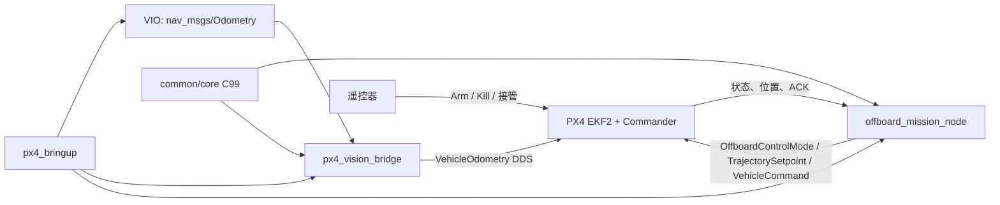

# BoomBoomFly 统一技术路线

本文定义当前架构、接口和安全边界；运行时证据与下一步见[handoff.md](handoff.md)。
优先级为：当前用户确认的任务与硬件约束 > handoff > 本文 > 历史资料与旧代码。

## 1. 阶段边界

第一阶段目标：

```text
观察未解锁 → 等待 PX4 本地定位健康 → RC 解锁沿 → Offboard
→ 相对本地 home 起飞 1.5 m → 悬停 60 s → 返回 home → Land
```

第一阶段不做目标追踪、投放、串口 START、程序 ARM/DISARM/Kill、MAVROS 双后端、Custom Mode/Executor
正式依赖、旧状态机兼容层或通用任务框架。

开发/仿真基线为 Ubuntu 22.04 + Humble + PX4 1.16.2 + `gz_x500`；实机目标为 Ubuntu 20.04 + Foxy +
Jetson Orin Nano + Pixhawk 2.4.8 + PX4 1.16.2。Humble 结果不能推断 Foxy 或实机通过。

## 2. 架构与所有权



| 包 | 职责 |
|---|---|
| `common` | C99 状态、原因、故障位、事件和日志 sink 契约；ROS 2 适配不得反向污染 core。 |
| `offboard_cpp` | 任务状态机与 PX4 I/O；唯一生产 writer 为 `/fmu/in/offboard_control_mode`、`/fmu/in/trajectory_setpoint`、`/fmu/in/vehicle_command`。 |
| `px4_vision_bridge` | 将规范化 Odometry 转为 `VehicleOdometry` 并经 DDS 注入 PX4。 |
| `px4_bringup` | 启动、参数和环境选择；不承载任务状态机，也不靠固定延迟判断 readiness。 |
| `communication` | 第一阶段仅保留边界，不提供运行节点或未确认协议。 |

任务只能使用 EKF2 输出的 `VehicleLocalPosition` 作为飞行反馈；原始 VIO 只用于 EKF2 注入和诊断。

## 3. 坐标、时间与视觉契约

- mission 内部使用 NED/FRD；VIO 输入 ENU/FLU 由 bridge 完成转换。
- 姿态使用完整旋转复合：`R_ned_frd = R_ned_enu · R_enu_flu · R_flu_frd`；协方差先完整变换再映射到
  PX4 可表达字段。
- 配置必须明确 world/body frame、pose/twist 参考系、D435i 到机体外参及未知协方差的表示。
- `/fmu/out/*` 订阅使用 PX4 uXRCE-DDS 兼容的 sensor-style QoS；新鲜度只用本地 steady clock 判断。
- 写入 PX4 的时间戳使用 ROS/DDS 时钟域微秒；采样时间、发送时间和本地接收时间分别记录，不得混用。
- `TimesyncStatus` 缺失、过期、输入不合法、时间倒退或不新鲜时，vision bridge 不发布。

## 4. 任务状态机

```text
BOOT → WAIT_DISARMED → WAIT_LOCALIZATION → READY
→ OFFBOARD_PRESTREAM → REQUEST_OFFBOARD → TAKEOFF → HOVER
→ RETURN_LOCAL → LAND_REQUEST → WAIT_LANDED → COMPLETE → WAIT_DISARMED
```

- 节点必须先见到一次 `DISARMED`。启动时已解锁则保持被动，直到完整观察到 `ARMED → DISARMED → ARMED`。
- 仅 `READY` 中、来源为 `STICK_GESTURE` 或 `RC_SWITCH` 的解锁上升沿启动任务；定位未健康时的解锁不缓存。
- 启动沿冻结 `home_x/y/z/heading`；NED 的起飞目标为 `home_z - 1.5 m`。位置 reset 时按 PX4 delta 修正 home
  与目标。
- 先以 20 Hz 发布位置保持 setpoint 至少 1 s，再请求 Offboard；只有 ACK 接受且实际进入 Offboard 才进入起飞。
- 起飞、悬停和返航的完成由 EKF2 位置/速度稳定判据证明；容差和 deadline 放入 YAML。
- `WAIT_LANDED` 只接受 Land 请求之后的新 `VehicleLandDetected.landed` 样本。

### 返航取消

`/offboard/cancel_mission` 使用 `std_srvs/srv/Trigger`。它只在 `HOVER` 接受，立即进入 `RETURN_LOCAL`，
使用冻结的本地 home 并沿用 Land 流程。其他状态和 Land 请求后均拒绝取消。

## 5. 失效与人工接管

| 条件 | 行为 |
|---|---|
| 状态或定位在取得 Offboard 前过期 | 不启动任务。 |
| Offboard 请求拒绝/超时且未取得控制 | 中止本轮尝试，不反复请求。 |
| 用户或 RC 切出 Offboard | 停止任务，本轮不抢回控制权。 |
| PX4 failsafe 或节点/Jetson 退出 | PX4 Offboard-loss/failsafe 接管；ROS 不依赖最后一条命令。 |
| VIO/EKF2 本地定位失效 | 请求原地 Land，不返航。 |
| 正常取消且定位有效 | 返回冻结本地 home 后 Land。 |

Kill 由 RC 直接映射到 PX4，不经过 Jetson、ROS 或任务状态机。取消、RC 接管、failsafe 与定位失效冲突时，
后面三者优先。

## 6. 配置与兼容性

配置按公共任务参数和 SITL/hardware 差异拆分。允许参数化的话题、更新频率、超时、目标高度、悬停时长、
速度/容差、frame、外参、协方差、设备路径和 PX4 参数；不得用 YAML 改变状态语义、坐标约定或安全不变量。

核心 C++ 只使用 Humble/Foxy 共有的基础 `rclcpp` API；不为假设的差异建立条件编译框架。Foxy/Jetson 必须
单独构建和无桨验证。

## 7. 后续顺序

补齐 SITL 故障证据 → 真实视觉与 Foxy/Jetson 无桨联调 → 经现场门禁批准的受控飞行 → 目标追踪与投放。
新增检测器只能发布目标状态，`offboard_cpp` 始终保持 PX4 控制单写入者。

## 8. 权威参考

- [PX4 v1.16 Offboard Mode](https://docs.px4.io/v1.16/en/flight_modes/offboard)
- [PX4 v1.16 External Position Estimation](https://docs.px4.io/v1.16/en/ros/external_position_estimation)
- [PX4 VehicleOdometry](https://docs.px4.io/v1.16/en/msg_docs/VehicleOdometry)
- `PX4/PX4-Autopilot v1.16.2`、`PX4/px4_msgs release/1.16`
