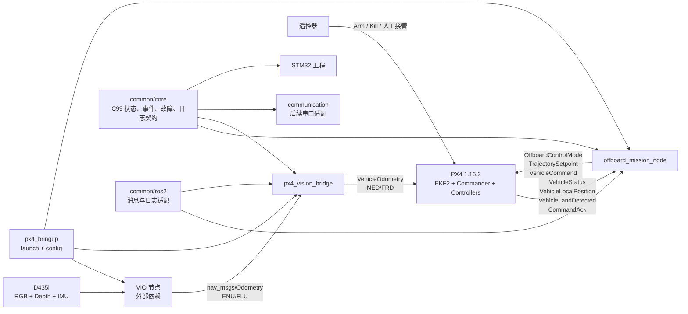

# BoomBoomFly 统一技术路线

## 1. 文档定位

本文把当前需求、重构交接和历史资料中仍然有效的技术结论整合为一条统一路线。第一阶段
已按本文的确认选择完成软件实现；本文仍是后续阶段的边界和决策依据，而不是旧代码的兼容
规范。

信息优先级如下：

1. 当前用户确认的任务与硬件约束；
2. [`handoff.md`](handoff.md) 中记录的现行结论；
3. 本文选择的第一阶段实现路线；
4. 已归档历史资料中的技术机制和源码研究；
5. 旧 `offboard_cpp` 的实现与接口。

旧代码和旧蓝图只提供事实或经验，不构成兼容要求。若它们与现行需求冲突，以现行需求和本文为准。

## 2. 实施状态与阶段边界

截至 2026-08-10，Phase 0–4 的源码重构、包级构建和单元测试已完成。已完成初步 SITL
DDS/readiness 和一次正常最小闭环：PX4 关键状态样本已到达 ROS 2，虚拟摇杆触发后 mission
node 完成 Offboard、起飞、悬停、返航和 Land 并回到 `READY`；尚未进行故障注入、视觉融合、
Foxy 或实机验证。Phase 5 仍只生成了现场门禁清单。当前
可验证证据与未完成门见
[`handoff.md`](handoff.md) 和 [`第一阶段实机门禁清单.md`](第一阶段实机门禁清单.md)。

最终任务目标为：

```text
等待
→ 遥控器解锁
→ 自动起飞
→ 视觉定位/目标追踪
→ 投放
→ 返回本地起飞点
→ 降落
```

当前第一阶段只验证最小飞行闭环：

```text
上电并观察一次未解锁
→ 等待 PX4 融合后的本地定位健康
→ 等待遥控器解锁上升沿
→ 预发送 Offboard 心跳和保持点
→ 请求进入 Offboard
→ 相对起飞点起飞 1.5 m
→ 定点悬停 60 s
→ 返回本地起飞点上方
→ 请求 Land
→ 等待着陆和解除解锁
```

第一阶段明确不做：

- 视觉目标检测、搜索、追踪和投放；
- 串口 START 或复杂上位机协议；
- 程序主动 ARM、DISARM 或 Kill；
- PX4 ROS 2 Custom Mode/ModeExecutor 正式依赖；
- MAVROS 与 DDS 双后端；
- lifecycle、composition、插件系统或通用序列化框架；
- 旧话题、旧类、旧状态机和旧 launch 的兼容层。

## 3. 第一阶段已实施技术选择

| 决策 | 第一阶段选择 | 原因 |
|---|---|---|
| PX4 控制接口 | `px4_msgs + uXRCE-DDS + Offboard` | 最短路径验证真实控制闭环，与 RC 解锁沿自动启动方式直接匹配 |
| 任务进程 | 一个 `offboard_mission_node` | 保证 PX4 控制输入单写入者，减少跨节点时序和所有权问题 |
| 任务内部结构 | `MissionController + Px4Interface` | 将纯任务逻辑和 ROS/PX4 I/O 分开，但不引入通用框架 |
| 坐标约定 | 飞行任务内部统一使用 NED/FRD | 避免在任务状态机内反复转换坐标 |
| 飞行反馈 | PX4 EKF2 输出的 `VehicleLocalPosition` | 控制依据必须是 PX4 已融合状态，不直接使用原始 VIO |
| 视觉注入 | `nav_msgs/Odometry → VehicleOdometry → DDS` | 只保留实机目标链路，避免双重注入 |
| `common` | 同包 `C99 core + ROS 2 adapter` | STM32、Linux 和 ROS 2 可以共用稳定数值契约 |
| `communication` | 保留包边界，不启动运行节点 | 第一阶段没有已确认的串口业务协议 |
| `px4_bringup` | Python launch + 分环境参数 | 只负责编排，不承载业务状态机 |

`px4-ros2-interface-lib` 的 Mode、Executor、Setpoint Type 和注册机制作为后续候选保留。只有第一阶段闭环稳定，且确实需要 GCS 可见的自定义模式、多个任务能力或 PX4 原生模式编排时，才重新评估引入。

## 4. 总体架构



两条视觉相关链路必须保持独立：

```text
飞机自身定位：
D435i → VIO → px4_vision_bridge → PX4 EKF2 → VehicleLocalPosition → offboard_cpp

目标追踪（后续阶段）：
检测与深度定位 → 目标坐标转换/状态估计 → offboard_cpp → PX4 Setpoint
```

原始 VIO 数据只能用于注入 EKF2 和诊断。飞行任务不得绕过 EKF2 直接闭环控制原始 VIO 位姿。

## 5. 包职责与依赖方向

### 5.1 `common`

负责跨 STM32、Linux 和 ROS 2 的稳定数值契约：

- 同步操作结果；
- 持续任务状态与进入原因；
- 可同时存在的故障位；
- 一次性结构化事件；
- 平台无关的日志记录入口。

核心层禁止依赖：

- `rclcpp`、ament 和 ROS 消息；
- PX4 消息；
- STM32 HAL；
- `std::string`、异常和 RTTI；
- 动态内存、文件系统和 UART；
- 业务状态机或具体硬件协议。

建议目录：

```text
common/
├── core/
│   ├── CMakeLists.txt
│   ├── include/boomboom_common/
│   │   ├── status.h
│   │   ├── state.h
│   │   ├── fault.h
│   │   ├── event.h
│   │   └── log.h
│   └── src/
├── ros2/
│   ├── include/boomboom_common_ros2/
│   └── src/
├── msg/
├── CMakeLists.txt
└── package.xml
```

信息模型采用以下分工：

| 信息 | 建议表达 | 用途 |
|---|---|---|
| 同步操作结果 | `domain + condition + detail` | 函数返回和策略判断 |
| 带返回值的操作 | 按需定义的 C tagged union | 只在调用者确实同时需要值和错误时使用 |
| 持续状态 | `state + reason + entered_at` | 当前任务/设备处于什么状态 |
| 并发硬件故障 | 固定宽度 bitmask | 快速快照多个活动故障 |
| 一次性事件 | 时间、序号、来源、状态、少量参数 | 上报、记录和离线分析 |
| 人类日志 | 平台 sink 格式化 | ROS 日志、UART、SWO、RTT 或环形缓冲区 |

第一版只定义实际使用的少量 domain、condition、state 和 event，不预建全项目错误码大全。串口编码必须逐字段写入，明确字节序和宽度，禁止直接 `memcpy` C 结构体。

### 5.2 `offboard_cpp`

第一阶段只负责：

- 观察 PX4 状态和定位健康；
- 识别符合条件的 RC 解锁上升沿；
- Offboard 预发送和模式请求；
- 起飞、悬停、返航和 Land 请求；
- 任务阶段、超时、结果和事件上报；
- 在定位失效、模式退出或 PX4 failsafe 时执行已确认的收口策略。

它是以下控制输入的唯一 writer：

```text
/fmu/in/offboard_control_mode
/fmu/in/trajectory_setpoint
/fmu/in/vehicle_command
```

推荐目录：

```text
offboard_cpp/
├── include/offboard_cpp/
│   ├── mission_controller.hpp
│   ├── mission_types.hpp
│   ├── px4_interface.hpp
│   └── offboard_mission_node.hpp
├── src/
│   ├── mission_controller.cpp
│   ├── px4_interface.cpp
│   ├── offboard_mission_node.cpp
│   └── main.cpp
├── config/
│   ├── mission_common.yaml
│   ├── sitl.yaml
│   └── hardware.yaml
├── launch/
└── test/
```

职责边界：

```text
MissionController
├── 纯 C++ 状态转换
├── 阶段目标和完成判据
├── timeout 与失败决策
└── 不包含 rclcpp、topic 名和 px4_msgs

Px4Interface
├── PX4 subscriptions/publishers
├── QoS、消息时间戳和命令构造
├── ACK 与 PX4 事实状态快照
└── 不决定任务下一阶段

OffboardMissionNode
├── 参数读取
├── 定时驱动
├── 连接 MissionController 与 Px4Interface
└── 结构化事件/日志适配
```

不为两个内部类建立虚接口、依赖注入容器或多后端框架。纯任务逻辑可以通过普通值类型输入输出进行测试。

### 5.3 `px4_vision_bridge`

负责把规范化 VIO `nav_msgs/msg/Odometry` 转换为 PX4 `px4_msgs/msg/VehicleOdometry`：

- ENU 世界坐标转换为 NED；
- FLU 机体坐标转换为 FRD；
- 正确复合姿态旋转；
- 根据输入 twist 契约转换线速度和角速度；
- 转换并压缩协方差信息；
- 处理采样时间、发送时间和 uXRCE-DDS 时钟域；
- 检查有限值、四元数、frame、时间单调性和输入新鲜度；
- 发布输入健康状态和结构化事件。

第一阶段只有 DDS 输出：

```text
VIO /nav_msgs/Odometry
→ px4_vision_bridge
→ /fmu/in/vehicle_visual_odometry
→ PX4 EKF2
```

推荐内部划分：

```text
OdometryConverter    纯数学和消息无关的转换
Px4OdometryBuilder   内部样本到 VehicleOdometry
VisionBridgeNode     参数、订阅、发布和健康状态
```

输入契约必须在配置中明确：

- `header.frame_id` 对应的世界坐标系；
- `child_frame_id` 对应的机体坐标系；
- pose 表达的是哪个 body 到哪个 world 的旋转；
- twist 在线性和角速度上使用的参考系；
- D435i/VIO 坐标系到机体 `base_link` 的外参；
- 未知协方差和不可用字段的表示。

不能仅对四元数分量交换轴。若输入姿态为 `R_enu_flu`，目标旋转应按矩阵关系构造：

```text
R_ned_frd = R_ned_enu · R_enu_flu · R_flu_frd
```

其中：

```text
R_ned_enu = [ 0  1  0
              1  0  0
              0  0 -1 ]

R_flu_frd = [ 1  0  0
              0 -1  0
              0  0 -1 ]
```

协方差先按完整变换矩阵转换，再提取 PX4 `VehicleOdometry` 可表达的 position、orientation 和 velocity 方差。不能把 ROS 6×6 数组未经解释地复制为 PX4 三元素数组。

### 5.4 `communication`

第一阶段不提供运行节点，只保留后续边界：

```text
结构化 task state / fault / event
→ communication 编码器
→ 串口 transport
→ 上位机
```

后续协议确定前不实现：

- 通用命令总线；
- 动态消息注册；
- 自动重连状态机；
- START 命令；
- 为未知上位机需求预留的大量字段。

协议设计时必须复用 `common/core` 的稳定数值字段，但在 wire format 中逐字段编码，并单独定义帧头、版本、长度、序号、载荷和 CRC。

### 5.5 `px4_bringup`

只负责：

- SITL 与实机 launch 入口；
- PX4、Micro XRCE-DDS Agent、VIO、bridge 和 mission node 的编排；
- 仿真/实机参数文件选择；
- namespace、设备路径和外部进程参数传递。

不负责：

- 飞行任务状态转换；
- 使用固定延迟猜测依赖已经就绪；
- 自动解锁；
- 在 launch 文件中复制节点业务参数。

节点必须依据输入新鲜度和 readiness 自己等待依赖。launch 可以启动进程，但不能把“进程已经创建”当成“系统已经可飞”。

## 6. 第一阶段任务状态机

```text
BOOT
  ↓
WAIT_DISARMED
  ↓ 已观察到一次 DISARMED
WAIT_LOCALIZATION
  ↓ 本地位置和高度有效且数据新鲜
READY
  ↓ RC 来源的 ARM 上升沿
OFFBOARD_PRESTREAM
  ↓ 20 Hz 持续至少 1 s
REQUEST_OFFBOARD
  ↓ ACK 接受且 nav_state == OFFBOARD
TAKEOFF
  ↓ 高度和垂直速度稳定满足完成条件
HOVER
  ↓ 稳定悬停 60 s
RETURN_LOCAL
  ↓ 回到起飞点水平位置并稳定
LAND_REQUEST
  ↓ Land 请求已接受或实际进入 Land
WAIT_LANDED
  ↓ PX4 确认 landed
COMPLETE
  ↓ 等待解除解锁
WAIT_DISARMED
```

### 6.1 启动门禁

任务节点启动后必须先看到一次 `VehicleStatus.arming_state == DISARMED`。如果节点启动时飞机已经解锁，则保持被动，直到完整观察到：

```text
ARMED → DISARMED → ARMED
```

只有处于 `READY` 时的解锁上升沿可以启动任务。定位未健康时发生的解锁不缓存、不晚补；操作员必须解除解锁，等待 `READY` 后重新解锁。

RC 来源通过 `VehicleStatus.latest_arming_reason` 判断，第一阶段只接受 `STICK_GESTURE` 或 `RC_SWITCH`。外部命令、任务自动解锁或其他来源不得触发任务。

### 6.2 Home 与高度

接受启动沿时，从新鲜且有效的 `VehicleLocalPosition` 快照本次任务 home：

```text
home_x = x
home_y = y
home_z = z
home_heading = heading（若有效）
```

NED 中向上为负，因此 1.5 m 起飞目标为：

```text
target_x = home_x
target_y = home_y
target_z = home_z - 1.5
```

悬停和返航都使用该次任务冻结的本地 home，不伪造全球坐标，不把 PX4 RTL 当作无 GPS 本地返航。

如果 PX4 报告本地位置 reset，应按 `VehicleLocalPosition` 的 reset counter 和 delta 字段修正保存的 home 与当前活动目标，避免目标在坐标系重置后跳变。

### 6.3 Offboard 握手

进入 `OFFBOARD_PRESTREAM` 后：

- 以 20 Hz 发布 `OffboardControlMode`；
- 同时发布当前位置保持 `TrajectorySetpoint`；
- 连续预发送至少 1 s 后才请求 Offboard；
- `OffboardControlMode.position = true`，其他控制层级关闭；
- 未控制的 velocity、acceleration、jerk 和 yaw rate 字段使用 PX4 约定的 `NaN`；
- 请求进入 Offboard 后同时观察匹配 ACK 和实际 `VehicleStatus.nav_state`。

ACK 只表示命令请求被接受，状态机不得仅凭 ACK 进入 `TAKEOFF`。如果请求被拒绝且从未取得 Offboard 控制，停止任务尝试并保持被动，不自动反复请求。

### 6.4 阶段完成

阶段完成必须由 PX4 融合状态证明：

| 阶段 | 完成证据 |
|---|---|
| Takeoff | 三轴位置误差进入容差，且垂直速度在稳定窗口内足够小 |
| Hover | 从到位稳定后开始计时，单调时钟累计 60 s |
| Return | 水平距离进入容差，且水平速度在稳定窗口内足够小 |
| Land | `VehicleLandDetected.landed` 为真，并等待 PX4/操作员解除解锁 |

具体容差、稳定窗口和阶段 deadline 使用 YAML 参数，不硬编码在状态机中。第一版只保留与真实飞行直接相关的参数。

## 7. 失效与人工接管策略

### 7.1 取得 Offboard 前

| 条件 | 行为 |
|---|---|
| 状态或定位数据过期 | 不启动任务 |
| 定位未健康时解锁 | 忽略本次上升沿，要求重新解锁 |
| Offboard 请求拒绝/超时 | 核对真实 nav state；未取得控制则中止尝试 |
| PX4 已 failsafe | 不请求 Offboard |

### 7.2 取得 Offboard 后

| 条件 | 行为 |
|---|---|
| 用户或 RC 切出 Offboard | 立即停止任务，本轮不自动恢复或抢权 |
| PX4 failsafe | 接受 PX4 接管，不再发送任务命令 |
| VIO/EKF2 本地定位持续失效 | 不盲目返航，请求原地 Land |
| 正常任务取消且定位仍有效 | 返回冻结的本地 home 后 Land |
| Offboard 心跳中断 | 由 PX4 `COM_OF_LOSS_T` 和 `COM_OBL_RC_ACT` 收口 |
| 节点或 Jetson 崩溃 | 依赖 PX4 Offboard-loss/failsafe，不依赖析构或最后一条命令 |

Kill 由遥控器直接映射 PX4，不经过 Jetson、ROS 或任务状态机。ROS 侧只观察结果、停止任务并记录事件，不实现第二套 Kill 控制链。

## 8. PX4 消息、QoS 与时间

第一阶段至少使用：

| 方向 | 消息 |
|---|---|
| PX4 → mission | `VehicleStatus`、`VehicleLocalPosition`、`VehicleLandDetected`、`VehicleCommandAck` |
| mission → PX4 | `OffboardControlMode`、`TrajectorySetpoint`、`VehicleCommand` |
| vision → PX4 | `VehicleOdometry` 到 `/fmu/in/vehicle_visual_odometry` |

所有 `/fmu/out/*` 订阅使用与 PX4 uXRCE-DDS 输出兼容的传感器风格 QoS，避免用默认 reliable QoS 导致不匹配。所有输入都分别记录：

```text
PX4/source timestamp
ROS receive steady time
valid flags
reset/generation counter（消息提供时）
```

新鲜度以本地 steady clock 判断，不能用系统墙钟直接计算 timeout。

ROS 侧写入 PX4 消息的非零 `timestamp` 和 `timestamp_sample` 使用 ROS/DDS 所在时钟域的微秒值，由 PX4 1.16.2 uXRCE-DDS 传输层按已同步 offset 转换到 PX4 boot time。视觉采样时间优先来自有效的输入 `header.stamp`；消息生成时间和采样时间不得混成一个值。仿真和实机都必须验证时钟同步已收敛以及采样时间单调。

## 9. 配置策略

配置按“公共任务参数”和“环境差异”拆分：

```text
config/
├── common/
│   ├── mission.yaml
│   └── vision_bridge.yaml
├── sitl/
│   ├── mission.yaml
│   ├── vision_bridge.yaml
│   └── px4.params
└── hardware/
    ├── mission.yaml
    ├── vision_bridge.yaml
    └── px4.params
```

只把以下内容参数化：

- 输入/输出话题和可选车辆 namespace；
- 更新频率、输入超时和阶段 deadline；
- 目标高度、悬停时长、速度上限和到位容差；
- frame 名称与相机外参；
- 协方差 fallback；
- SITL/实机设备路径和 PX4 参数。

状态枚举、协议语义、坐标轴定义和安全不变量不能通过 YAML 随意改变。

## 10. Humble/Foxy 兼容路线

开发和仿真基线：

```text
Ubuntu 22.04 + ROS 2 Humble + PX4 1.16.2 + Gazebo gz_x500
```

实机目标：

```text
Jetson Orin Nano + Ubuntu 20.04 + ROS 2 Foxy + Pixhawk 2.4.8 + PX4 1.16.2
```

实现原则：

- C++ 节点只使用 Humble/Foxy 共有的基础 `rclcpp` API；
- 除 launch 外不新增 Python 业务节点；
- 不使用只有 Humble 才有的便利 API 来建立核心逻辑；
- `px4_msgs` 固定使用与 PX4 1.16 对应的 `release/1.16`；
- 不提前建立条件编译兼容框架，遇到真实差异再做局部适配；
- Foxy 已停止上游维护，因此最终实机环境必须单独构建和验证，不能由 Humble 结果推断兼容。

## 11. 实施阶段

### Phase 0：冻结路线与清理边界

目标：在写新代码前确定新骨架。

工作项：

1. 确认本文四项核心选择：直接 Offboard、`communication` 无运行节点、C99 `common/core`、结构化状态模型；
2. 为五个包列出保留、删除和重写清单；
3. 单独判断 `hardware.pdf`、旧标定和 STM32 代码的客观价值；
4. 删除仍绑定旧 START/authority/多任务方案的无用源码和配置；
5. 固定 PX4、`px4_msgs` 和 Agent 版本。

退出条件：目录骨架、包职责、消息流和状态机获得确认。

### Phase 1：`common` 最小核心

目标：建立跨平台状态、事件、故障和日志契约。

工作项：

1. 实现最小 C99 头文件和源码；
2. 提供独立 CMake target，允许 STM32 直接纳入源码；
3. 增加 C++ `extern "C"` 使用示例；
4. 实现 ROS 2 日志和结构化消息适配；
5. 只定义第一阶段实际需要的 mission/vision 状态与事件。

退出条件：core 不依赖 ROS/PX4/Linux，ROS 适配不反向污染 core。

### Phase 2：`offboard_cpp` SITL 最小闭环

目标：在 `gz_x500` 完成第一阶段状态机。

工作项：

1. 实现 `MissionController` 纯状态机；
2. 实现 `Px4Interface` 的状态、ACK、Setpoint 和命令边界；
3. 实现 RC 来源解锁沿门禁；
4. 实现 prestream、Offboard、起飞、悬停、返航和 Land；
5. 实现定位 reset 修正、模式退出和定位失效 Land；
6. 通过 `common` 上报状态、故障和事件。

退出条件：SITL 正常路径和关键故障路径均有可重复证据。

### Phase 3：`px4_vision_bridge` 数据链

目标：证明 PX4 能稳定融合外部视觉，并为实机闭环提供定位。

工作项：

1. 固定 VIO 输入契约与 D435i 外参；
2. 实现纯转换函数；
3. 实现 DDS `VehicleOdometry` 输出；
4. 配置 EKF2 外部视觉融合参数；
5. 验证静止、单轴移动、单轴旋转、时间延迟和 reset；
6. 确认 `VehicleLocalPosition` 由 EKF2 正常输出且 reset 可处理。

退出条件：未解锁条件下完成外部视觉融合验证。未达到该条件不得进入实机自主起飞。

### Phase 4：bringup 与双环境配置

目标：形成明确的仿真和实机启动入口。

工作项：

1. 重写 SITL launch；
2. 重写实机 launch；
3. 分离公共、SITL 和硬件参数；
4. 节点依据 readiness 自己等待，不使用固定 `TimerAction`；
5. 固定日志和证据采集入口。

退出条件：启动入口不包含自动 ARM，不依赖旧比赛任务节点。

### Phase 5：实机地面与受控飞行

顺序：

```text
静态坐标检查
→ 手持位移/旋转
→ 无桨 PX4/DDS/RC 联调
→ 系留或保护场地短时起飞
→ 1.5 m 悬停
→ 60 s 悬停
→ 本地返航和降落
```

每一步只在前一步证据通过后进行。Kill、人工模式接管、定位中断和 Jetson 进程退出必须在正式任务前分别验证。

### Phase 6：目标追踪与投放扩展

只有目标类型、搜索区域、飞行高度和投放机构确定后才开始。

预计增加：

```text
TargetObservation
→ 坐标转换和时间对齐
→ TargetState
→ 目标新鲜度与丢失策略
→ 跟踪 Setpoint
→ PayloadCommand/Feedback
```

保持 `offboard_cpp` 为 PX4 控制单写入者。检测器只发布目标状态，不直接写 PX4 Setpoint。

### Phase 7：重新评估 External Mode/Executor

满足以下任一条件时才评估：

- 需要在 QGC 中显示和选择自定义任务模式；
- 任务由多个可独立注册的飞行能力组成；
- 需要由 Executor 编排 PX4 内部 Takeoff/Land/RTL 和自定义 Mode；
- 直接 Offboard 的模式管理已经成为主要维护负担。

评估时复用八课资料中的以下结论：

- Mode 负责持续飞行能力，Executor 负责任务顺序；
- Owned Mode 是控制权入口，不是 C++ 所有权；
- ACK、`ModeCompleted`、`VehicleStatus` 和失权是不同证据；
- Setpoint Type 同时表达控制层级和 PX4 requirements；
- 接口库不能代替项目业务输入 freshness 和阶段 deadline。

不自动恢复第八课中的七 Mode 蓝图、START lease、复杂 safety supervisor 或 legacy 双后端迁移方案。

## 12. 验证矩阵

本文定义后续应达到的验证范围，不表示当前阶段立即运行测试。

| 层级 | 重点 |
|---|---|
| `common/core` | C/C++ 可调用、数值布局、无动态内存、事件序号和字段编码 |
| 纯任务逻辑 | 启动门禁、状态转换、timeout、reset、取消和失败策略 |
| 视觉数学 | 位置、姿态、速度、角速度和协方差转换 |
| ROS 节点 | QoS、参数、输入新鲜度、消息构造和单 writer |
| SITL | Offboard 握手、1.5 m 起飞、60 s 悬停、返航、Land |
| 故障注入 | 定位失效、状态过期、ACK 超时、模式退出、PX4 failsafe、节点退出 |
| 实机 | RC 来源、Kill、人工接管、VIO reset、DDS 时钟和受控飞行 |

每次飞行验证至少记录：

```text
源码和参数版本
PX4 与 px4_msgs 版本
任务状态事件
VehicleStatus / VehicleLocalPosition / LandDetected
Command 与 ACK
VIO 输入与 VehicleOdometry 输出
PX4 ulog
结果摘要和异常时间点
```

## 13. 必须保持的不变量

1. 节点启动后必须先观察到一次未解锁状态。
2. 第一阶段只有 RC 来源的解锁上升沿能启动任务。
3. 程序不发送 ARM、DISARM 或 Kill。
4. Kill 不依赖 Jetson、ROS 或 Offboard 节点。
5. 任一 PX4 控制输入只有一个生产 writer。
6. 飞行反馈来自 PX4 EKF2 融合状态，不来自原始 VIO。
7. 定位有效时才允许本地返航；定位失效时原地 Land。
8. 用户或 PX4 使系统退出 Offboard 后，本轮任务不自动抢回。
9. ACK 接受不等于实际状态已经完成切换。
10. 控制、状态、故障、事件和日志不是同一种信息。
11. `common/core` 不依赖 ROS、PX4、Linux 或 STM32 HAL。
12. launch 不自动解锁，也不把固定延迟当 readiness。
13. 未确定的目标检测、投放和串口协议不提前实现。
14. 不为兼容旧代码而保留没有外部约束价值的接口。

## 14. 待确认但不阻塞骨架的事项

- D435i 安装方向、相机到机体外参和最终 VIO 算法；
- EKF2 外部视觉的最终参数与协方差；
- 除 Kill 外的 RC Hold/Position、Return 等开关配置；
- STM32 实际语言和构建入口；
- STM32 日志 sink 使用 UART、SWO、RTT 还是环形缓冲区；
- communication 的第一版串口数据和协议；
- 视觉目标、搜索区域、搜索方式和任务飞行高度；
- 投放机构、执行器接口和反馈信号。

这些问题未确定时，只保留明确边界，不创建占位状态机、抽象基类或通用协议。

## 15. 资料采用说明

| 原资料 | 本路线采用内容 | 不采用内容 |
|---|---|---|
| Interface Library Lesson 01–07 | 能力/流程分层、控制层级、ACK 与事实状态、失权/failsafe 语义 | 第一阶段直接依赖 External Mode/Executor |
| Course Summary | PX4 身份、权限、控制、完成证据的统一心智模型 | 旧 BoomBoomFly 最终组件图 |
| Lesson 08 | 单写入者、业务 freshness、deadline、用户接管后不抢回 | 七 Mode 蓝图、START/lease、旧任务迁移和复杂 supervisor |
| PX4 Vision Bridge 总结 | 坐标系、时间戳、协方差、输入验证和逐层联调 | MAVROS 双后端和过早的通用 backend 抽象 |
| Common 学习指南 | 状态、日志、诊断、事件不能混用；公共库保持稳定边界 | C++ `std::string` Status、C++17 `StatusOr` 和多 ROS 子包方案 |

## 16. 权威参考

- [PX4 v1.16 Offboard Mode](https://docs.px4.io/v1.16/en/flight_modes/offboard)
- [PX4 v1.16 ROS 2 Control Interface](https://docs.px4.io/v1.16/en/ros2/px4_ros2_control_interface)
- [PX4 v1.16 External Position Estimation](https://docs.px4.io/v1.16/en/ros/external_position_estimation)
- [PX4 VehicleOdometry](https://docs.px4.io/v1.16/en/msg_docs/VehicleOdometry)
- `PX4/PX4-Autopilot v1.16.2`
- `PX4/px4_msgs release/1.16`
- `Auterion/px4-ros2-interface-lib release/1.16`，仅作为后续候选参考
