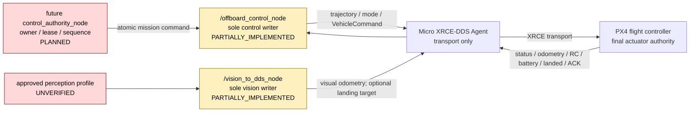
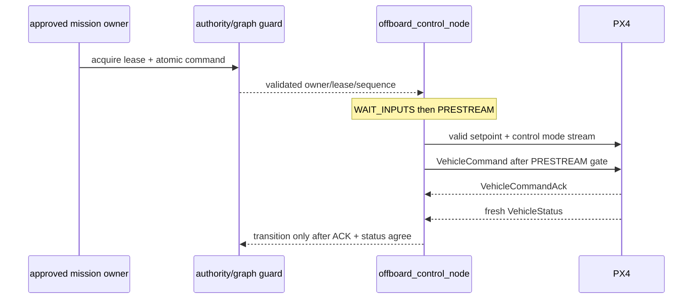

# BoomBoomFly 控制权运行契约

> 文档状态：`STATICALLY_VERIFIED`
>
> 核对基线：`master@5a0e6edd4930474506a1046d414425893ebd800f`
>
> production：`BLOCKED`

本文把已接受的 DDS-only 决策映射为节点职责、writer 基数和后续运行时门禁。规范性来源是 [ADR-0001](../adr/0001-dds-only-control-authority.md) 与 [控制权矩阵](../CONTROL_AUTHORITY_MATRIX.md)；本文不取代它们，也不声称尚未实现的门禁已经生效。

## 1. 权威链



PX4 始终保留飞控、执行器和自身 failsafe 的最终权威。ROS 侧 writer 唯一性只解决“谁可以请求”，不代表 ROS 可以绕过 PX4 preflight 或 failsafe。

## 2. 当前角色与唯一 writer

| 控制面 | 唯一允许角色 | 允许写入 | 当前状态 | production 条件 |
|---|---|---|---|---|
| PX4 trajectory/mode/command | `/offboard_control_node` | `/fmu/in/trajectory_setpoint`、`/fmu/in/offboard_control_mode`、`/fmu/in/vehicle_command` | `PARTIALLY_IMPLEMENTED`：publisher 已实现，运行时排他为 `PLANNED` | graph guard、readiness、ACK、freshness、fault lattice 全部通过 |
| 外部视觉 | `/vision_to_dds_node` | `/fmu/in/vehicle_visual_odometry`；独立精降 profile 中可选 `/fmu/in/landing_target_pose` | `PARTIALLY_IMPLEMENTED`：基础 publisher 存在 | frame/time/quality/health、EKF2 和单 writer 验收通过 |
| 上层 mission | 一个正式 arbiter | `/offboard/cmd`、`/offboard/cmd_mode`、`/offboard/takeoff_land` | `PLANNED`：正式 arbiter 不存在 | owner/lease/sequence/epoch/heartbeat 和原子事务通过 |
| PX4 feedback | 目标 PX4 | `/fmu/out/*` | `PARTIALLY_IMPLEMENTED`：若干真实输出仅有 `HISTORICAL_EVIDENCE`；`rc_channels` 为 `BLOCKED`，ACK subscriber 为 `PLANNED`；逐 topic 状态见 [数据流](DATA_FLOW.md) | 当前 identity、topic/type/QoS/freshness 可证明 |
| Transport | 一个 Micro XRCE-DDS Agent | XRCE 数据转发，不决定 payload | `HISTORICAL_EVIDENCE`：带日期的 session 记录 | 单一 machine-readable profile、端口独占、identity guard |

Agent 不是 ROS 控制 owner；QGroundControl 也不是 DDS production control writer。production 不保留第二条飞控传输链。

## 3. Mission owner 规则

当前源码中的候选 owner 是互斥集合：

```text
/offboard_demo_node
XOR /animal_testing_node
XOR future /control_authority_node
```

约束：

- demo 与 animal 只允许隔离 SITL，production 中禁止。
- 正式 `/control_authority_node` 为 `PLANNED`，当前仓库不能声称它已实现。
- 一个 profile 同时只能有一个 owner；owner 必须同时拥有 setpoint、mode 和 takeoff/land 三类内部命令的发布权。
- 当前消息没有 owner ID、lease ID、sequence、deadline 或 session epoch，所以只启动一个节点仍只是文档规则，不是运行时保证。
- owner 消失、重复、重连或 sequence 回退时，计划中的 arbiter 必须撤销 authority、清空旧事务并要求重新获取有效 lease；该能力当前为 `PLANNED`。

### 计划中的最小 owner envelope

下列是后续接口评审要求，不是当前消息定义：

| 字段/能力 | 目的 | 状态 |
|---|---|---|
| `owner_id` | 识别候选 mission owner | `PLANNED` |
| `lease_id` 与 expiry | 防止无期限控制权 | `PLANNED` |
| monotonic `sequence` | 拒绝重复、乱序和旧消息 | `PLANNED` |
| session/PX4 epoch | 隔离 owner、Agent 或 PX4 重启前消息 | `PLANNED` |
| mode + setpoint 原子 payload | 防止旧 mode 与新 setpoint 混配 | `PLANNED` |
| deadline/freshness | 让过期命令 fail-closed | `PLANNED` |
| explicit acquire/release/renew | 可审计地转移 authority | `PLANNED` |

## 4. Graph cardinality 契约

### 4.1 目标基数

| Graph 对象 | offline | sensor-isolated | px4-read-only | sitl-dds | bench-dds | production-dds |
|---|---:|---:|---:|---:|---:|---:|
| Micro XRCE-DDS Agent | 0 | 0 | 1 | 1 | 1 | 1 |
| `/offboard_control_node` | 0 | 0 | 0 | 0 或 1 | 逐门放行，最多 1 | 恰好 1 |
| mission owner | 0 | 0 | 0 | 0 或 1 | 默认 0 | 恰好 1 个正式 arbiter |
| `/vision_to_dds_node` | 0 | 隔离输出，不能连 `/fmu/in/*` | 0 | 0 或 1 | 逐门放行，最多 1 | profile 启用时恰好 1 |
| PX4 feedback writer | 0 | 0 | 目标 PX4 1 个 | SITL PX4 1 个 | 目标 PX4 1 个 | 目标 PX4 1 个 |
| 旧 bringup/mock | 0 | mock 仅独立 domain | 0 | 0 | 0 | 0 |

表中的 “1” 是通过对应门禁后的最大/目标实例数，不表示默认启动。`bench-dds` 与 `production-dds` 当前均为 `BLOCKED`。

### 4.2 Graph guard 要求

graph guard 当前为 `PLANNED`。后续必须同时满足：

1. 在创建任何控制 publisher 之前检查 profile、namespace、domain、Agent 与 vehicle identity。
2. 持续观察 graph，而不是只在启动时取一次快照。
3. 三个 PX4 控制输入必须由同一个目标节点拥有，不能分别落到不同实例。
4. 三个 `/offboard/*` mission 输入必须来自同一有效 lease。
5. 视觉启用时最多一个目标 writer；baseline 精降 publisher 必须不存在。
6. 发现重复 writer、禁止节点、mock feedback 或 identity 冲突时不得进入 ACTIVE，并产生稳定故障事件。
7. 故障消失后不能自动恢复旧 authority；需要健康窗口和新的有效 lease。

当前源码可以重复启动控制/视觉节点，也没有 graph API 排他检查。因此 writer 规则是 `STATICALLY_VERIFIED` 的架构决策，运行时强制仍为 `PLANNED`。

## 5. Command authority 与状态确认

### 5.1 目标事务



整个序列为 `PLANNED`。当前实现不等待 ACK、没有 owner/lease、没有显式 PRESTREAM，而且启动后会以 50 Hz 发布 setpoint/mode。

### 5.2 必需能力

| 能力 | 当前事实 | 状态 | production 解除条件 |
|---|---|---|---|
| VehicleCommand ACK | 无 subscription、pending correlation 或 result 分类 | `PLANNED` | ACCEPTED/IN_PROGRESS/全部拒绝码、超时、迟到、错误 target 和重启 epoch 测试通过 |
| VehicleStatus freshness | 仅缓存最新消息，无首帧/receive time | `PLANNED` | ACK 后只用 fresh、同 epoch 状态二次确认 |
| PRESTREAM | 50 Hz 持续发布是实现副作用，没有 readiness/样本计数 | `PLANNED` | 所有输入 ready 后连续不少于 1 s 且不少于 20 个有效样本才允许 mode request |
| mode/setpoint 原子性 | 两个 topic 分别缓存，ACTIVE 只检查 trajectory freshness | `PLANNED` | 同 owner/lease/sequence/time window，字段组合合法 |
| startup/reconnect safe state | 初始为 POSITION，并可能立即发布/请求模式 | `BLOCKED` | BOOT/WAIT_INPUTS/STANDBY/FAULT_LATCHED 默认无控制输出 |

## 6. Feedback authority 与 mock 边界

- `/fmu/out/*` 的 production 权威 writer 只能是目标 PX4 经目标 Agent 转发的数据。
- `mock_rc_control.py` 只能用于独立 ROS domain/namespace 的自动化测试，不能连接真实 Agent/PX4，也不能作为 SITL firmware、bench 或实机证据。
- 当前 production target 无条件编译 `TEXT_RC`，且自动起飞路径可在从未收到 RC 时跳过互锁。这是 `BLOCKED`，不是可接受 fallback。
- PX4 v1.16.2 默认 firmware 不导出 `/fmu/out/rc_channels`。定制 firmware profile 与真实 PX4-source SITL payload 为 `PLANNED`。
- 2026-07-24 参数快照是 `HISTORICAL_EVIDENCE`，不能用于声明当前 RC 映射、kill switch、DDS 或 failsafe 参数。

## 7. Transport 与 namespace 权威

当前单机契约：

| 项目 | 当前值/规则 | 状态 |
|---|---|---|
| ROS namespace | `/` | `STATICALLY_VERIFIED` |
| PX4 input/output | `/fmu/in/*`、`/fmu/out/*` | `STATICALLY_VERIFIED` |
| mission interface | `/offboard/*` | `STATICALLY_VERIFIED` |
| PX4 transport | uXRCE-DDS only | `STATICALLY_VERIFIED` |
| `/dev/ttyTHS0` owner | DDS transport 独占；不得被第二个飞控传输或串口进程复用 | `STATICALLY_VERIFIED` 的规则；运行时 `UNVERIFIED` |
| DDS domain/client key/system identity | 尚无统一机器配置源 | `PLANNED` |
| `/drone1` 等多机 namespace | 不支持 | `BLOCKED` |

production 不保留备用传输。旧 `px4_bringup`、swarm launch 或 SD 卡 namespace 示例都不能改变当前单机根 namespace 决策。未来多机必须另立 ADR 并验证跨机命令不可达性。

## 8. 故障处置决策边界

fault lattice 当前为 `PLANNED`。对 RC loss、DDS loss、odometry loss、VehicleStatus stale、battery stale、PX4 reboot、Agent restart、mission owner loss 和 vision loss，本文只冻结以下共同要求：

- 检测有明确 deadline、epoch 和稳定事件码；
- 撤销旧 owner/lease 和 pending VehicleCommand；
- 不沿用陈旧 setpoint、status、ACK 或视觉样本；
- 不自动恢复 ACTIVE；
- 恢复需要新鲜输入、连续健康窗口和新的有效 lease；
- 正常、单故障和组合故障必须在单元测试与 PX4 DDS SITL 中验证。

具体故障下选择 Land、Position、保持 PX4 failsafe 或停止 ROS 输出，可能因飞行阶段和仍可用的反馈而产生相反风险。该选择全部保留为安全评审项，不能由本文自行决定。详见 [故障传播](FAULT_PROPAGATION.md)。

## 9. 禁止 authority 路径

以下任一项均不得出现在 production graph：

- 第二个 command/setpoint 或外部视觉 writer；
- 旧 `px4_bringup` 入口；
- `mock_rc_control.py` 或其他 `/fmu/out/*` mock writer；
- demo/animal mission owner；
- 多个 control writer、vision writer、mission owner 或 Agent；
- communication 包直接写 `/fmu/*` 或控制 `/offboard/*`；
- 非目标 profile 定义的 precision landing publisher；
- `/dev/ttyTHS0` 被 DDS 之外的进程占用；
- 未由新 ADR 定义的 swarm namespace 或 identity。

## 10. 当前状态

| 项目 | 状态 | 结论 |
|---|---|---|
| DDS-only 决策 | `STATICALLY_VERIFIED` | 继续作为唯一 production 候选链 |
| 单一 writer 规则 | `STATICALLY_VERIFIED` | 规则已冻结，运行时未强制 |
| graph guard | `PLANNED` | production blocker |
| owner/lease | `PLANNED` | production blocker |
| VehicleCommand ACK | `PLANNED` | production blocker |
| PRESTREAM | `PLANNED` | production blocker |
| fault lattice | `PLANNED` | production blocker |
| SITL control acceptance | `UNVERIFIED` | 阻塞拆桨台架 |
| 拆桨台架 | `UNVERIFIED` | 所有 P0 关闭前禁止 |
| production | `BLOCKED` | 不允许启用 |
