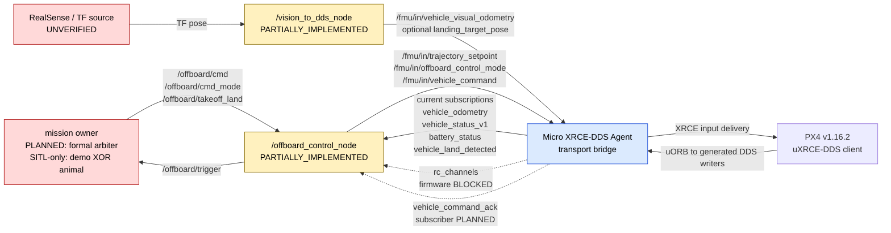

# BoomBoomFly 数据流与 topic 契约

> 文档状态：`STATICALLY_VERIFIED`
>
> 核对基线：`master@5a0e6edd4930474506a1046d414425893ebd800f`
>
> 核对方式：当前 checkout 的源码、ADR、控制权矩阵和带日期历史证据；本轮未启动 ROS、PX4、Agent、SITL 或硬件。
>
> production：`BLOCKED`

本文描述当前单机根 namespace 基线的数据方向、writer 权威和缺失数据行为。它不授权启动节点，也不把静态源码存在、历史 discovery 或计划中的安全门描述成运行验证。

## 1. 数据流总览

边界说明：

- `/fmu/in/*` 是 ROS 侧到 PX4 的输入。只有控制 writer 或视觉 writer 可以产生这些消息。
- `/fmu/out/*` 是目标 PX4 经 Agent 转发到 ROS graph 的权威反馈。mock/bag 只能用于隔离测试，不能作为 bench 或 production 权威来源。
- `/offboard/*` 是 mission owner 与底层控制节点之间的内部接口，不是 PX4 原生接口。
- Micro XRCE-DDS Agent 只做 transport bridge，不是 trajectory、mode、command 或视觉内容的决策 owner。
- 当前只批准一个 PX4、一个 Agent、根 namespace `/`。多机 namespace、client key、domain 和 vehicle identity 契约均为 `PLANNED`。

## 2. QoS 证据边界

| 端点实现 | 当前源码配置 | 状态 | 限制 |
|---|---|---|---|
| `offboard_control_node` 的 PX4 输入 publisher、PX4 输出 subscription 和 `/offboard/*` 端点 | KeepLast(1)、best-effort、volatile | `STATICALLY_VERIFIED` | 同一配置被用于不同方向；与 PX4 生成端点的逐 topic 兼容性为 `UNVERIFIED` |
| demo/animal mission owner | KeepLast(1)、best-effort、volatile | `STATICALLY_VERIFIED` | 只允许隔离 SITL，不能作为 production owner |
| `vision_to_dds_node` 的 PX4 输入 publisher | `create_publisher(..., 10)` 的 ROS 2 默认 QoS | `STATICALLY_VERIFIED` | 与 Offboard 配置不一致；PX4 reader 实际消费为 `UNVERIFIED` |
| 2026-07-25 PX4 output discovery/payload | 若干输出曾被发现并解码 | `HISTORICAL_EVIDENCE` | 没有证明当前 checkout、当前 session 或所有端点的 exact QoS |

因此，下表中的 “QoS 状态” 只表示本端代码配置是否可静态确认；除非明确注明，不代表端到端 DDS 兼容或 PX4 实际收包已经验证。

## 3. `/fmu/in/*`：PX4 输入

| Topic | Publisher | Subscriber | 方向 | 消息类型 | QoS 状态 | Freshness 要求 | 权威 writer | 缺失或无效时的要求 | 能力状态 |
|---|---|---|---|---|---|---|---|---|---|
| `/fmu/in/trajectory_setpoint` | `/offboard_control_node` | PX4 uXRCE-DDS reader | ROS → PX4 | `px4_msgs/msg/TrajectorySetpoint` | `STATICALLY_VERIFIED`（端到端 `UNVERIFIED`） | 当前节点以 50 Hz 无条件发布；计划要求 feedback/authority ready 后显式 PRESTREAM，连续不少于 1 s 且不少于 20 个有效样本，ACTIVE 中持续新鲜 | 仅 `/offboard_control_node` | 当前会发送默认/缓存值，不能视为合格 fail-closed；预期在 readiness/PRESTREAM 前不产生控制发布 | `PARTIALLY_IMPLEMENTED` |
| `/fmu/in/offboard_control_mode` | `/offboard_control_node` | PX4 uXRCE-DDS reader | ROS → PX4 | `px4_msgs/msg/OffboardControlMode` | `STATICALLY_VERIFIED`（端到端 `UNVERIFIED`） | 必须与同一 owner/lease/sequence 的 setpoint 同一新鲜事务；当前没有配对门且以 50 Hz 发布 | 仅 `/offboard_control_node` | 缺失、陈旧或与 setpoint 冲突时不得请求/保持 ACTIVE；具体 PX4 降级动作待安全评审 | `PARTIALLY_IMPLEMENTED` |
| `/fmu/in/vehicle_command` | `/offboard_control_node` | PX4 uXRCE-DDS reader | ROS → PX4 | `px4_msgs/msg/VehicleCommand` | `STATICALLY_VERIFIED`（端到端 `UNVERIFIED`） | 事件型事务；需要 pending deadline、command/target/epoch correlation、ACK 和 fresh status 二次确认；当前只使用固定 3 s 状态观察超时 | 仅 `/offboard_control_node` | 没有 ACK 或状态不一致时不得认定成功或推进状态；拒绝/超时后的安全动作待评审 | `PARTIALLY_IMPLEMENTED` |
| `/fmu/in/vehicle_visual_odometry` | `/vision_to_dds_node` | PX4 uXRCE-DDS reader / EKF2 | ROS → PX4 | `px4_msgs/msg/VehicleOdometry` | `STATICALLY_VERIFIED`（默认 QoS；端到端 `UNVERIFIED`） | 节点目标频率默认 20 Hz，仅在 TF stamp 前进时发布；最大 age、时钟域、reset、quality 和 freeze deadline 尚未定义 | 仅 `/vision_to_dds_node` | TF 缺失时当前停止该次发布；stale/future/reset/错误 frame 的系统级门未实现，production 必须保持禁用 | `PARTIALLY_IMPLEMENTED` |
| `/fmu/in/landing_target_pose` | `/vision_to_dds_node`，仅显式精降 profile | PX4 uXRCE-DDS reader / landing target consumer | ROS → PX4 | `px4_msgs/msg/LandingTargetPose` | `STATICALLY_VERIFIED`（默认 QoS；端到端 `UNVERIFIED`） | 仅随新视觉 TF 发布；target freshness、quality、frame 和 deadline 未闭合 | 仅 `/vision_to_dds_node` | baseline `enable_precland=false` 时 publisher 不存在；继续保持关闭，直到独立 firmware/profile 和验收完成 | `PLANNED` |

关键负向事实：

- ROS → PX4 输入的实际交付、type/QoS 匹配和 PX4 消费均为 `UNVERIFIED`。
- 显式 PRESTREAM 状态机为 `PLANNED`；当前持续发布只是实现现象，不是预热门验收。
- `VehicleCommandAck` 订阅、结果分类和 correlation 为 `PLANNED`。
- baseline 不启用 precision landing；不能通过参数临时开启后宣称获得 production 能力。

## 4. `/fmu/out/*`：PX4 权威反馈

| Topic | Publisher | Subscriber | 方向 | 消息类型 | QoS 状态 | Freshness 要求 | 权威 writer | 缺失或无效时的要求 | 能力状态 |
|---|---|---|---|---|---|---|---|---|---|
| `/fmu/out/vehicle_odometry` | 目标 PX4，经 Agent 转发 | `/offboard_control_node`；SITL-only mission owner 也可读 | PX4 → ROS | `px4_msgs/msg/VehicleOdometry` | `STATICALLY_VERIFIED`（本端）；端到端 `UNVERIFIED` | 配置阈值 0.5 s；还应检查首帧、finite、frame、PX4 epoch 和 clock rollback | 目标 PX4 | 当前 timeout/position-jump 路径存在，但首帧判断和成员初始化有缺陷；不能据此宣称安全降级 | `PARTIALLY_IMPLEMENTED` |
| `/fmu/out/vehicle_status_v1` | 目标 PX4，经 Agent 转发 | `/offboard_control_node` | PX4 → ROS | `px4_msgs/msg/VehicleStatus`（`MESSAGE_VERSION=1`） | `STATICALLY_VERIFIED`（topic/本端）；历史 discovery 为 `HISTORICAL_EVIDENCE` | 必须具有首帧、receive-time、PX4 epoch 和 freshness；当前均缺失 | 目标 PX4 | 当前会持续使用缓存状态；预期 stale 时不得确认 ACK、arm 或 mode 迁移 | `PARTIALLY_IMPLEMENTED` |
| `/fmu/out/rc_channels` | 定制 PX4 v1.16.2 firmware profile，经 Agent 转发 | `/offboard_control_node` | PX4 → ROS | `px4_msgs/msg/RcChannels` | 本端 `STATICALLY_VERIFIED`；firmware/端到端 `BLOCKED` | 配置阈值 0.5 s；已检查首帧、`signal_lost`、channel count、finite/range 和 ROS receive age | 仅目标 PX4；mock 仅隔离测试且非权威 | 无 topic、无首帧、lost、stale 或 invalid 均应禁止 arm/Offboard；当前自动起飞无 RC 时可绕过，且 production target 含 mock override | `BLOCKED` |
| `/fmu/out/battery_status` | 目标 PX4，经 Agent 转发 | `/offboard_control_node` | PX4 → ROS | `px4_msgs/msg/BatteryStatus` | `STATICALLY_VERIFIED`（本端）；历史 payload 为 `HISTORICAL_EVIDENCE` | 配置阈值 0.5 s，但没有首帧/epoch/finite 完整门 | 目标 PX4 | 当前缺失或 stale 后不触发确定故障动作；预期行为必须纳入 fault lattice 和安全评审 | `PARTIALLY_IMPLEMENTED` |
| `/fmu/out/vehicle_land_detected` | 目标 PX4，经 Agent 转发 | `/offboard_control_node` | PX4 → ROS | `px4_msgs/msg/VehicleLandDetected` | `STATICALLY_VERIFIED`（本端）；端到端 `UNVERIFIED` | 当前无独立 receive-time/freshness；计划要求首帧、epoch 和 freshness | 目标 PX4 | 当前 `landed` 在首帧前可能未初始化；缺失时不得宣告着陆或完成 land 事务 | `PARTIALLY_IMPLEMENTED` |
| `/fmu/out/vehicle_command_ack` | 目标 PX4，经 Agent 转发 | 计划由 `/offboard_control_node` 订阅；当前无 subscriber | PX4 → ROS | `px4_msgs/msg/VehicleCommandAck` | `UNVERIFIED` | 需要与 pending command、target identity、PX4 epoch 和 deadline 关联；阈值待协议评审 | 目标 PX4 | 当前完全不消费；预期缺失、迟到、错误 command/target 或拒绝码均不得推进事务 | `PLANNED` |

`/fmu/out/rc_channels` 的特殊约束：PX4 v1.16.2 默认 DDS topic 集不导出它，而 Offboard 安全互锁要求它。必须先完成锁定 firmware profile 的静态生成、PX4-source SITL payload 和 FMUv3 artifact 取证。本轮没有构建或刷写 firmware。

## 5. `/offboard/*`：内部 mission 接口

| Topic | Publisher | Subscriber | 方向 | 消息类型 | QoS 状态 | Freshness 要求 | 权威 writer | 缺失或无效时的要求 | 能力状态 |
|---|---|---|---|---|---|---|---|---|---|
| `/offboard/cmd` | 每个 profile 选定的一个 mission owner | `/offboard_control_node` | mission → controller | `px4_msgs/msg/TrajectorySetpoint` | `STATICALLY_VERIFIED` | 配置阈值 0.5 s，但当前构造时间可冒充首帧，且没有 owner/sequence/finite 检查 | 单一 mission owner；demo XOR animal 仅隔离 SITL；正式 arbiter 尚未实现 | 缺失/陈旧时当前 OFFBOARD 转 AUTO_HOVER；最终 PX4 动作须与 fault lattice 一致并经安全评审 | `PARTIALLY_IMPLEMENTED` |
| `/offboard/cmd_mode` | 与 `/offboard/cmd` 相同的 mission owner | `/offboard_control_node` | mission → controller | `px4_msgs/msg/OffboardControlMode` | `STATICALLY_VERIFIED` | 配置阈值 0.5 s；必须与 setpoint 同 owner/lease/sequence/time window；当前 ACTIVE 路径没有 freshness/配对检查 | 与 `/offboard/cmd` 相同的唯一 mission owner | 缺失、stale 或字段冲突时不得向 PX4 转发该事务 | `PARTIALLY_IMPLEMENTED` |
| `/offboard/takeoff_land` | 与上述相同的 mission owner | `/offboard_control_node` | mission → controller | `std_msgs/msg/UInt8` | `STATICALLY_VERIFIED` | 当前是单次 latch 到下一 FSM tick；没有 deadline、sequence、owner 或 ACK | 与上述相同的唯一 mission owner | 无授权 owner/lease 时不得触发；旧/重复命令必须拒绝，当前未实现 | `PARTIALLY_IMPLEMENTED` |
| `/offboard/trigger` | `/offboard_control_node` | 当前选定 mission owner | controller → mission | `std_msgs/msg/Bool` | `STATICALLY_VERIFIED` | 当前无 sequence/epoch/deadline；计划与 authority session 绑定 | 仅 `/offboard_control_node` | 缺失时 mission 不应开始/继续发送控制事务；精确恢复规则待 owner/lease 协议定义 | `PARTIALLY_IMPLEMENTED` |

当前源码提供两个候选 mission publisher：`/offboard_demo_node` 与 `/animal_testing_node`。二者必须互斥，并且都只允许用于隔离 SITL。计划中的正式 `control_authority_node`/arbiter 为 `PLANNED`，不能描述为已存在。

## 6. Writer 基数与 transport 不变量

以下是目标不变量，不是当前运行时保证：

| 范围 | 目标基数 | 当前执行状态 |
|---|---:|---|
| trajectory/mode/VehicleCommand writer | 每个目标 PX4 恰好 1 个 `/offboard_control_node` | graph guard `PLANNED` |
| external vision writer | 启用视觉的 profile 最多 1 个 `/vision_to_dds_node` | graph guard `PLANNED` |
| mission owner | 每个 profile 恰好 0 或 1 个，ACTIVE 时恰好 1 个正式 arbiter | owner/lease `PLANNED` |
| Agent | 每个当前单机 profile 恰好 1 个 | machine-readable identity profile `PLANNED` |
| PX4 feedback writer | 每个 `/fmu/out/*` 恰好来自目标 PX4 | 当前动态身份校验 `UNVERIFIED` |
| `/dev/ttyTHS0` transport owner | 仅 DDS Agent | 文档规则 `STATICALLY_VERIFIED`；运行 guard `PLANNED` |

MAVROS、旧 `px4_bringup`、mock feedback、demo/animal production 使用、重复 control/vision writer 和任何 communication 包对 `/fmu/*` 或控制 `/offboard/*` 的发布均是禁止路径。

## 7. 验证缺口

- graph guard：`PLANNED`
- mission owner/lease/sequence/epoch：`PLANNED`
- VehicleCommand ACK 事务：`PLANNED`
- 显式 WAIT_INPUTS/PRESTREAM/MODE_PENDING：`PLANNED`
- fault lattice 与组合故障优先级：`PLANNED`
- ROS → PX4 exact QoS 与实际消费：`UNVERIFIED`
- 当前 DDS session、domain、client key 和 vehicle identity：`UNVERIFIED`
- SITL：`UNVERIFIED`
- 拆桨台架：`UNVERIFIED`
- 有限实机控制：`UNVERIFIED`

在这些阻塞关闭前，production 保持 `BLOCKED`。

## 8. 依据

- [ADR-0001：DDS-only 控制权](../adr/0001-dds-only-control-authority.md)
- [控制权与发布者矩阵](../CONTROL_AUTHORITY_MATRIX.md)
- [当前 PX4、DDS 与 Offboard 审查](../repository_audit/03_PX4_DDS_OFFBOARD_AUDIT.md)
- [当前风险登记册](../repository_audit/09_RISK_REGISTER.md)
