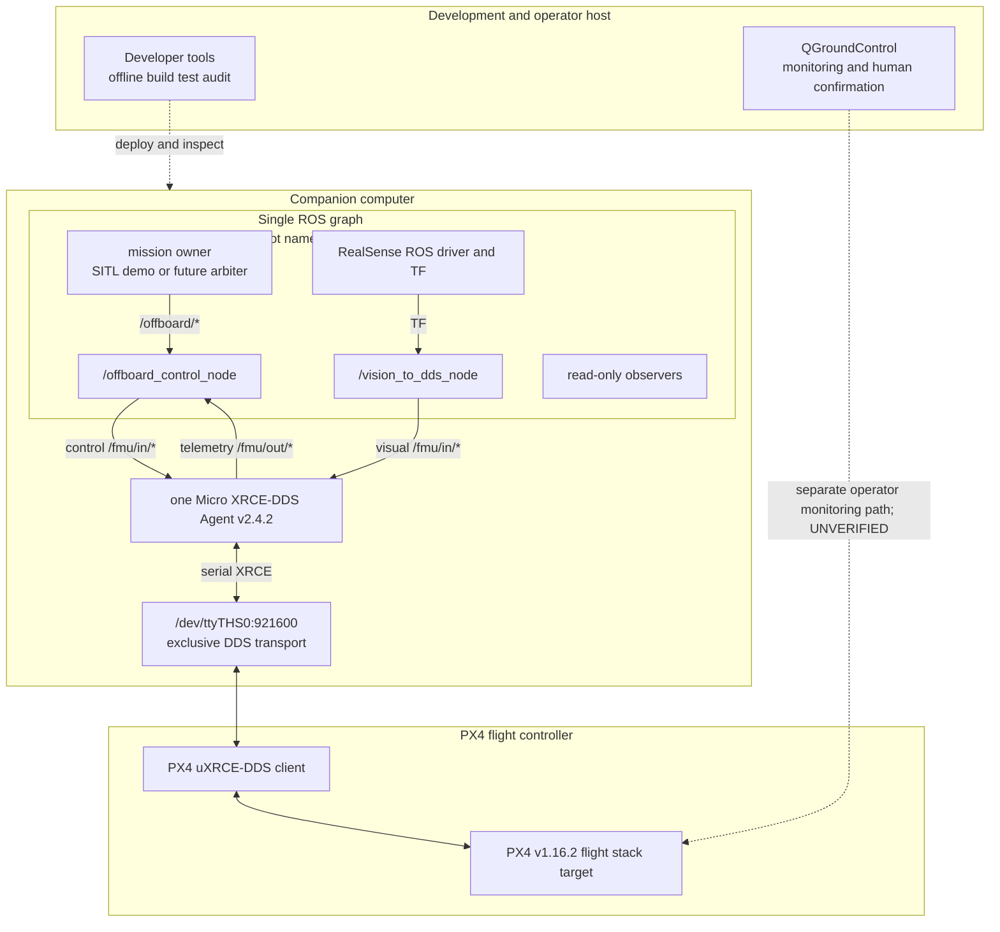
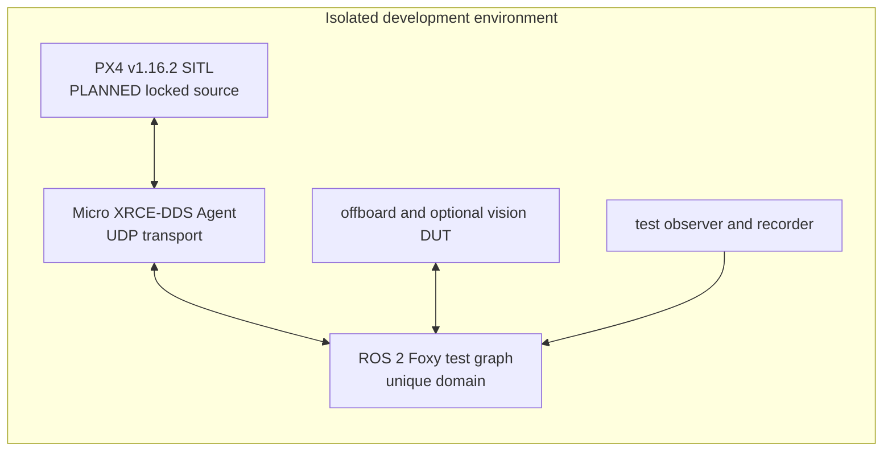

# BoomBoomFly 部署拓扑

> 文档状态：`STATICALLY_VERIFIED`
> checkout：`master@5a0e6edd4930474506a1046d414425893ebd800f`
> production：`BLOCKED`

本文把进程、设备和传输边界映射到部署位置。它是静态拓扑说明，不是当前设备在线证明，也不是启动授权。

## 1. Production 候选部署

部署图所示的硬件版本、OS 和既有 DDS session 来源于历史证据，均不构成本轮动态验证。QGroundControl 路径必须与 DDS TELEM2 资源分离；当前物理连接方式为 `UNVERIFIED`。

## 2. 部署单元与责任

| 部署单元 | 组件 | 资源/接口 | 责任 | 当前状态 |
|---|---|---|---|---|
| Development host | Git、colcon、测试和审计工具 | repository、isolated build output | 离线开发和验证 | checkout `STATICALLY_VERIFIED` |
| Companion computer | ROS 2 Foxy nodes | root namespace `/` | mission、control、vision、observer | 平台 `HISTORICAL_EVIDENCE`；节点未运行 |
| Companion computer | Micro XRCE-DDS Agent v2.4.2 | DDS graph + exclusive serial | transport bridge | lock `STATICALLY_VERIFIED`；session `HISTORICAL_EVIDENCE` |
| Companion computer | RealSense ROS driver | USB、TF | sensor/TF source | 设备存在仅 `HISTORICAL_EVIDENCE` |
| PX4 controller | PX4 v1.16.2 uXRCE-DDS client | TELEM2 serial、uORB/DDS endpoints | flight stack and authority feedback | `HISTORICAL_EVIDENCE` |
| Operator host | QGroundControl | 独立 operator link | monitoring、人工确认 | `UNVERIFIED` |

## 3. 网络、domain 与 identity

当前架构只批准一个 ROS graph 和根 namespace，但仓库尚无统一 machine-readable transport profile 来锁定：

- 数字 `ROS_DOMAIN_ID`；
- PX4 XRCE client key；
- Agent transport 参数；
- PX4 system/component identity；
- QGroundControl 的独立连接资源；
- ROS graph 与目标 PX4 的一一绑定。

这些配置能力是 `PLANNED`，缺失时 production 为 `BLOCKED`。不得用默认值、历史命令或节点 namespace 推断 identity 已正确绑定。

## 4. 串口独占模型

| 资源 | 唯一允许 owner | 被禁止的并发 owner | 处置 |
|---|---|---|---|
| `/dev/ttyTHS0:921600` | 一个 Micro XRCE-DDS Agent | 旧 `px4_bringup`、通用 serial driver、第二个 Agent 或其他飞控传输 | 发现冲突即 no-go；不得启动控制链 |

`/dev/ttyTHS0` 仅承载 DDS。PX4 侧 TELEM2 对应的精确当前参数及回滚值尚未重采，为 `UNVERIFIED`；2026-07-24 快照是 `HISTORICAL_EVIDENCE`。

## 5. Profile 部署差异

| Profile | PX4 | Agent | Control writer | Vision writer | Hardware | 状态 |
|---|---|---|---|---|---|---|
| `offline-static` | 无 | 无 | 无 | 无 | 无 | `IMPLEMENTED` |
| `sensor-isolated` | 无 | 无 | 无 | 隔离输出，不连接 `/fmu/in/*` | 单传感器 | `PLANNED` |
| `px4-read-only` | 实机 telemetry | 1 | 无 | 无 | 经单次授权 | session `HISTORICAL_EVIDENCE` |
| `sitl-dds` | PX4 SITL | 1（UDP） | 最多 1 | 最多 1 | 无实机 | `PLANNED` |
| `bench-dds` | 实机、拆桨/执行器隔离 | 1 | 逐门放行 | 逐门放行 | 需要硬件授权 | `BLOCKED`、`UNVERIFIED` |
| `production-dds` | 实机 | 1 | 1 | 最多 1 | 完整系统 | `BLOCKED` |

“最多 1”只是数量上限，不表示默认获准启动。demo/animal mission owner 只允许未来封装在隔离 SITL profile；正式 production mission owner 必须是未来 arbiter，状态为 `PLANNED`。

## 6. SITL 拓扑

项目级 SITL 入口、PX4 source/toolchain identity、fault injection 和 evidence 绑定尚未实现，因此为 `PLANNED`。SITL 验收必须使用 PX4 生成的权威 publisher/payload，不能用 mock 替代。

## 7. 感知部署

RealSense 驱动应产生受管 TF，`/vision_to_dds_node` 只在设备 identity、frame、安装外参、sample time、freshness、reset、quality 和 PX4 EKF 前置条件全部满足后获得发布许可。当前基础发布器已存在，但上述 profile 和健康门为 `BLOCKED`。

历史盘点中的 D435、T265、USB camera、VPU 和 RPLIDAR 状态不得当作当前在线清单。baseline precision landing 保持禁用；可选 publisher 的代码存在不等于 profile 已实现。

## 8. 多机拓扑边界

现有 `offboard_swarm_control.launch.py` 能创建三个命名空间节点，但没有每机 Agent/client key/domain/port/system identity 或 owner 契约。它属于禁止入口，多机能力是 `BLOCKED`。

未来多机部署必须至少满足：

1. 每机独立 identity 与 namespace；
2. transport/Agent 的隔离模型；
3. 每机唯一 control、vision 和 mission owner；
4. 跨机 topic 与命令不可达性；
5. 独立 ADR、SITL、台架和 rollback 证据。

## 9. 部署 no-go

以下任一条件成立即禁止进入 control deployment：

- production 仍为 `BLOCKED`；
- `/dev/ttyTHS0` owner 不唯一；
- graph 中存在旧 bringup、mock、demo/animal 或重复 writer；
- ROS domain、Agent、PX4 identity 无法绑定；
- `/fmu/out/rc_channels` firmware profile 未完成；
- graph guard、owner/lease、ACK、PRESTREAM 或 fault lattice 未实现；
- 当前 firmware、参数、toolchain 或 rollback identity 缺失；
- 试图从根 namespace 推断或启动多机。

## 10. 相关文档

- [系统总览](SYSTEM_OVERVIEW.md)
- [节点清单](NODE_INVENTORY.md)
- [控制权矩阵](../CONTROL_AUTHORITY_MATRIX.md)
- [ADR-0001](../adr/0001-dds-only-control-authority.md)
