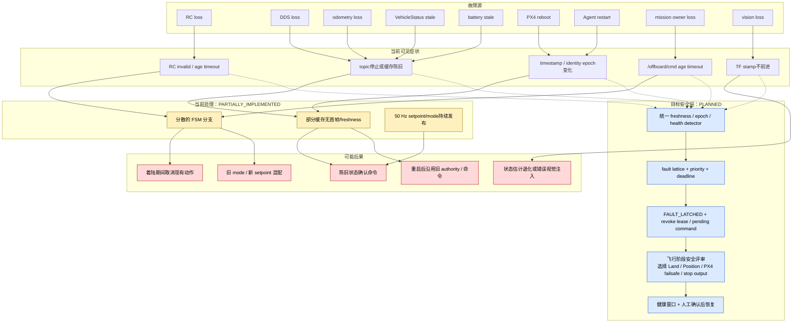

# BoomBoomFly 故障传播与安全评审边界

> 文档状态：`STATICALLY_VERIFIED`
>
> 核对基线：`master@5a0e6edd4930474506a1046d414425893ebd800f`
>
> 动态故障注入：`UNVERIFIED`
>
> production：`BLOCKED`

本文基于当前源码和审查发现描述故障如何进入控制链、当前代码怎样处理，以及目标系统还需要哪些安全门。本文不选择危险场景下的最终飞行动作；Land、Position、保持 PX4 failsafe 或停止 ROS 输出均须由逐飞行阶段的安全评审决定。

## 1. 传播总图



图中的虚线表示目标检测路径尚未实现。当前没有统一 fault evaluator、稳定故障码、组合故障优先级或人工复位协议。

## 2. 阻塞等级定义

| 等级 | 含义 |
|---|---|
| P0 | 可能导致错误控制、错误状态迁移或不确定安全动作；关闭前禁止拆桨台架控制 |
| P1 | 集成或发布门缺失；适用 profile 关闭前禁止 promotion |
| P2 | 可观察性、治理或非主线能力缺口；可能成为后续验收前置 |

“production 阻塞等级”引用统一审查的风险含义，不表示本文创建了真实 issue。

## 3. 单故障传播矩阵

### 3.1 RC loss

| 字段 | 结论 |
|---|---|
| 当前行为 | RC parser 已检查首帧、`signal_lost`、channel count、finite/range 和 0.5 s receive-time freshness。AUTO_HOVER/OFFBOARD 中失效会进入返回 POSITION 的分支并请求退出 Offboard；AUTO_LAND 中失效会取消着陆并请求退出 Offboard。自动起飞路径在 RC 从未收到时反而跳过 RC 检查，且 production target 含 mock override。 |
| 当前状态 | `PARTIALLY_IMPLEMENTED` |
| 预期行为 | fresh authoritative RC 必须成为任何 arm/Offboard 入口的硬门；loss 必须产生稳定故障事件、撤销 authority、清除 PRESTREAM/pending transaction，并禁止自动恢复。最终飞行动作须按飞行阶段评审。 |
| 未验证 | PX4-source RC topic、真实 function mapping、kill 映射、loss deadline、SITL/台架动作与人工复位全部 `UNVERIFIED`。 |
| production 阻塞 | P0；`BLOCKED` |

### 3.2 DDS loss

| 字段 | 结论 |
|---|---|
| 当前行为 | 没有 DDS session health/epoch detector。RC、odometry、battery 的部分 receive-time check 可能随 topic 停止而超时，但 VehicleStatus 和 landed 没有 freshness；控制节点仍以 50 Hz 发布 setpoint/mode，是否到达 PX4 不可知。各缓存不会作为一个原子 epoch 清空。 |
| 当前状态 | `UNVERIFIED` |
| 预期行为 | 在有界 deadline 内识别 session loss，原子失效所有 PX4 feedback、owner lease、PRESTREAM 和 pending ACK；session 恢复后不得沿用旧状态或自动 ACTIVE。最终选择停止输出、请求模式/着陆或依赖 PX4 failsafe须安全评审。 |
| 未验证 | Agent/PX4 disconnect 的检测时间、PX4 自身 Offboard loss 参数/行为、恢复后的 endpoint identity 和组合故障均 `UNVERIFIED`。 |
| production 阻塞 | P0（统一 fault lattice）；`BLOCKED` |

### 3.3 Odometry loss

| 字段 | 结论 |
|---|---|
| 当前行为 | 代码使用 0.5 s age 与 position-jump 条件。POSITION 中失效会请求 ALTCTL；AUTO_HOVER/OFFBOARD 中失效会转 POSITION 并请求退出 Offboard；AUTO_LAND 中失效会取消着陆。首帧逻辑在更新时间后判断 “是否首帧”，并可能读取未初始化位置/`pos_jump`。 |
| 当前状态 | `PARTIALLY_IMPLEMENTED` |
| 预期行为 | 首帧、finite、frame、jump、receive-time、PX4 timestamp/epoch 必须统一验证；loss 清除 setpoint readiness 并进入锁存故障。各飞行阶段的目标动作须评审，不能默认复用当前分支。 |
| 未验证 | 首帧、stale、jump、NaN/Inf、clock rollback、恢复健康窗口和 PX4/SITL 实际 mode 行为均 `UNVERIFIED`。 |
| production 阻塞 | P0；`BLOCKED` |

### 3.4 VehicleStatus stale

| 字段 | 结论 |
|---|---|
| 当前行为 | `State_Data_t` 只覆盖缓存，没有 `has_received`、receive timestamp 或 PX4 epoch。arm、mode 和退出 Offboard 的完成判定直接读取该缓存；陈旧值可能被解释为当前命令结果。 |
| 当前状态 | `BLOCKED` |
| 预期行为 | 每次安全相关状态迁移必须使用 fresh、同 PX4 epoch 的 VehicleStatus，并与对应 VehicleCommandAck 共同确认；stale 时撤销 pending 事务且不得宣告成功。最终飞行动作待评审。 |
| 未验证 | 首帧、stale threshold、ACK/status 乱序、PX4 reboot、错误 target/source 和真实 SITL result 均 `UNVERIFIED`。 |
| production 阻塞 | P0；`BLOCKED` |

### 3.5 Battery stale

| 字段 | 结论 |
|---|---|
| 当前行为 | 配置 nominal timeout 为 0.5 s，但缓存构造时 stamp 为当前时间且没有首帧标志；收到 fresh 低电量时可进入 `WANRING`/land 流程，未收到或 stale 后则没有确定故障动作。当前低电量动作也不使用 ACK/fresh status 闭环。 |
| 当前状态 | `PARTIALLY_IMPLEMENTED` |
| 预期行为 | 区分从未收到、stale、invalid 与真实低电量；把它们纳入 fault lattice、deadline 和结构化诊断。是否请求 Land、保持现有动作或交给 PX4 failsafe 必须结合电池状态可信度和飞行阶段评审。 |
| 未验证 | 当前电池 profile、阈值适用性、消息 finite/range、loss/low battery 响应和组合故障全部 `UNVERIFIED`。 |
| production 阻塞 | P0（故障处理闭环）；`BLOCKED` |

### 3.6 PX4 reboot

| 字段 | 结论 |
|---|---|
| 当前行为 | 没有 PX4 boot-time/epoch 或 identity 重置检测。旧 VehicleStatus、landed、mission command 和 pending mode/arm 标志不会作为一个 epoch 原子失效；VehicleCommand target/source system/component 固定为 1。 |
| 当前状态 | `UNVERIFIED` |
| 预期行为 | 检测 PX4 timestamp 回退/session identity 变化，撤销 lease、清空反馈缓存、ACK pending、PRESTREAM 和 setpoint；回到无控制输出的初始化态，并要求 operator 明确重新授权。 |
| 未验证 | reboot 信号来源、deadline、DDS entity 重建顺序、PX4 参数/failsafe 状态和 SITL 故障注入均 `UNVERIFIED`。 |
| production 阻塞 | P0；`BLOCKED` |

### 3.7 Agent restart

| 字段 | 结论 |
|---|---|
| 当前行为 | 没有 Agent lifecycle/identity health 输入。restart 表现为临时 topic 断流和 endpoint 重建；部分缓存超时，VehicleStatus/landed 仍可陈旧，mission owner 与控制 timer 继续运行。 |
| 当前状态 | `UNVERIFIED` |
| 预期行为 | Agent session epoch 变化等同 transport loss：原子失效 PX4 feedback 与控制事务，验证恢复后的 domain/client key/target identity，禁止自动重放旧命令。 |
| 未验证 | endpoint 消失/重建时序、graph discovery 抖动、双 Agent 冲突、session 恢复和人工复位均 `UNVERIFIED`。 |
| production 阻塞 | P0/P1（fault lattice + transport identity）；`BLOCKED` |

### 3.8 Mission owner loss

| 字段 | 结论 |
|---|---|
| 当前行为 | `/offboard/cmd` receive age nominally 0.5 s；OFFBOARD 中 stale 会转 AUTO_HOVER。`cmd_mode` 没有在 ACTIVE 路径联合 freshness 检查，takeoff/land 没有 owner/deadline；没有 owner ID、lease、sequence、heartbeat 或 graph guard。 |
| 当前状态 | `PARTIALLY_IMPLEMENTED` |
| 预期行为 | lease expiry 在有界时间撤销 owner，拒绝该 owner 后续旧/乱序消息，清空 mode+setpoint 原子事务，并进入锁存状态；新 owner 必须重新 acquire 且不能继承旧 setpoint。最终 PX4 动作待评审。 |
| 未验证 | 双 owner、owner crash/restart、旧 owner 重连、网络分区、sequence rollback 和人工切换全部 `UNVERIFIED`。 |
| production 阻塞 | P0；`BLOCKED` |

### 3.9 Vision loss

| 字段 | 结论 |
|---|---|
| 当前行为 | `vision_to_dds_node` 只有 TF stamp 前进时发布；TF lookup 异常时本次不发布并 sleep。没有最大 TF age、独立 health、reset/quality 更新或向 authority 层报告 loss。PX4/EKF2 可能随后停止输出可靠 odometry，但当前参数和行为未验证。 |
| 当前状态 | `PARTIALLY_IMPLEMENTED` |
| 预期行为 | stale/frozen/future/reset/non-finite/frame mismatch 必须撤销视觉发布资格并发出结构化 health；authority 与 PX4 estimator health 联合决定是否仍允许依赖视觉的 profile。具体 Land/Position/停止输出策略须安全评审。 |
| 未验证 | frame/time 数学、TF freeze deadline、T265 缺失/重连、EKF2 innovation/reset、PX4 odometry 连锁退化和 SITL 均 `UNVERIFIED`。 |
| production 阻塞 | 启用视觉 profile 时 P0；`BLOCKED` |

## 4. 组合故障与 fault lattice

当前 fault lattice 为 `PLANNED`。单一 `if/else` 顺序不能表达组合故障的优先级，例如：

| 组合 | 当前风险 | 必须评审的问题 |
|---|---|---|
| RC loss + DDS loss | ROS 既无法确认 operator 互锁，也无法确认命令是否到达 PX4 | 是否还能安全发送任何请求；PX4 本地 failsafe 的参数、状态与时限是什么 |
| odometry loss + AUTO_LAND | 当前实现可取消着陆并请求退出 Offboard | 继续/取消 land 哪个更安全；剩余高度/其他估计源/ACK 是否可信 |
| battery stale + VehicleStatus stale | 无法确认电池风险，也无法确认模式/arming | 是否保持任务、请求动作或停止输出；什么证据足以作决定 |
| PX4 reboot + Agent restart | 两个 epoch 同时变化，旧 endpoint 可能重新出现 | 如何绑定新 PX4/Agent identity；多久后允许人工重新授权 |
| owner loss + vision loss | 命令源和状态估计源同时消失 | 是否还有安全 hold/land 条件；禁止自动切换备用 owner/视觉源 |
| duplicate writer +任一 telemetry loss | 控制来源竞争且反馈不足 | graph guard 是否应锁存所有 writer；如何证明错误 writer 已不可达 |

目标 lattice 至少需要以下维度：

```text
flight phase
× authority state
× PX4/Agent epoch
× feedback freshness set
× estimator health
× RC/kill state
× VehicleCommand transaction state
× fault priority and deadline
```

每个格点必须定义检测条件、允许动作集合、禁止动作、deadline、锁存条件、恢复条件和 evidence。没有安全评审批准的格点必须默认为 `BLOCKED`。

## 5. 当前与目标状态机差异

| 项目 | 当前 | 目标 | 状态 |
|---|---|---|---|
| 启动态 | `POSITION`，timer 首次 tick 即计算并发布 | `BOOT/WAIT_INPUTS`，无控制输出 | `BLOCKED` |
| 数据 readiness | RC 较完整；其余不一致 | 所有必需输入 typed validity + freshness + epoch | `PLANNED` |
| PRESTREAM | 无显式状态 | 连续时间与样本数门，故障清零 | `PLANNED` |
| mode/arm/land 命令 | 发出后看缓存状态或 timeout | ACK pending + fresh status + correlation | `PLANNED` |
| fault handling | 分散在任务 FSM 分支 | 独立 fault evaluator/lattice | `PLANNED` |
| fault recovery | 部分分支可直接继续/重试 | 锁存、健康窗口、人工确认 | `PLANNED` |
| 诊断 | 自由文本日志 | 稳定 fault code/event timeline | `PLANNED` |

## 6. 安全评审待决项

以下事项必须由控制、PX4、安全和运维责任人共同批准，本文不作决定：

1. 各飞行阶段遇到 RC/DDS/odom/status/battery/owner/vision loss 时的允许动作集合。
2. 何时应请求 Land、Position/Altitude、保持 PX4 当前 failsafe，或停止 ROS setpoint/mode 输出。
3. 如果 DDS 已丢失，ROS 发出的“安全命令”是否仍有意义，以及何时禁止继续重试。
4. AUTO_LAND 中 odometry/RC loss 是否允许改变已开始的 landing 动作。
5. battery telemetry stale 与真实低电量应否采用不同动作和 deadline。
6. PX4/Agent reboot 后重新加入的最小健康窗口、identity 证明和 operator confirmation。
7. kill switch 的来源、优先级、去抖、锁存、释放和重启后状态。
8. 组合故障的优先级与最坏响应时间。

待决项关闭前，相关路径一律 `BLOCKED`。

## 7. 验证要求

### Level 0：静态与单元

- typed freshness/epoch wrapper 的首帧、stale、negative age 和 clock mismatch 测试；
- 所有 ACK result、错误 target/command、迟到/重复/timeout；
- owner/lease expiry、乱序/重复、旧 owner 重连；
- odometry/visual NaN/Inf、jump、frame/time/reset；
- fault lattice 每条边与每个组合故障的表驱动断言；
- graph guard 对 duplicate writer、禁止节点和 mock 的负向测试。

当前整体状态：`UNVERIFIED`。

### Level 1：PX4 DDS SITL

- 使用 PX4 publisher/reader，不得用 mock 替代 PX4 contract；
- 注入 RC/DDS/odom/status/battery/owner/vision loss；
- 注入 PX4 reboot、Agent restart、ACK reject/timeout 和双 writer；
- 记录 source identity、topic/type/QoS、event timeline、响应 deadline 和最终状态；
- 任一未在安全评审矩阵中的迁移都失败。

当前整体状态：`UNVERIFIED`。

### Level 2/3

拆桨台架与有限实机均为 `UNVERIFIED`，且 Level 2/3 运行需独立授权。所有 P0 关闭、SITL 通过和 runbook 获批前不得进入拆桨台架；有限实机必须另行授权。

## 8. 依据

- [数据流与 topic 契约](DATA_FLOW.md)
- [控制权运行契约](CONTROL_AUTHORITY.md)
- [ADR-0001：DDS-only 控制权](../adr/0001-dds-only-control-authority.md)
- [统一发现登记册](../audits/2026-07-26/07_FINDINGS_REGISTER.md)
- [验证矩阵](../audits/2026-07-26/09_VALIDATION_MATRIX.md)
