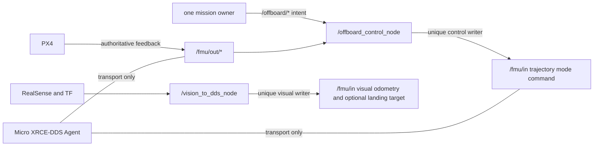

# BoomBoomFly 节点与进程清单

> 文档状态：`STATICALLY_VERIFIED`
> checkout：`master@5a0e6edd4930474506a1046d414425893ebd800f`
> 方法：只读核对 CMake、C++、launch、README、ADR 和审查报告；未启动 ROS graph或硬件。

## 1. 清单口径

- “production 允许”表示安全门全部完成之后的目标 allowlist，不表示现在可以启动。
- production 当前整体状态是 `BLOCKED`。
- “启动入口”列出仓库内可见入口；`BLOCKED` 入口不得因为文件存在而使用。
- 节点运行时名称来自源码 `Node(...)`；可执行文件名来自 CMake/launch。
- 当前没有 ROS graph 动态发现，实例数、实际 QoS 和端点交付均为 `UNVERIFIED`。

## 2. Production 候选与 transport

| 进程/节点 | 包/部署 | 输入 | 输出 | 控制权限 | production 允许 | 启动入口 | 当前验证状态 |
|---|---|---|---|---|---|---|---|
| `/offboard_control_node`（exe `offboard_node`） | `offboard_cpp` | `/fmu/out/vehicle_odometry`、`vehicle_status_v1`、`rc_channels`、`battery_status`、`vehicle_land_detected`；`/offboard/cmd`、`cmd_mode`、`takeoff_land` | `/fmu/in/trajectory_setpoint`、`offboard_control_mode`、`vehicle_command`；`/offboard/trigger` | 三个 PX4 control input 的唯一允许 writer | 目标为是；当前 `BLOCKED` | `offboard_control.launch.py` 等包内 launch 均未获实机批准 | 节点 `IMPLEMENTED`；topic contract/RC parser `UNIT_TESTED`；安全闭环 `PARTIALLY_IMPLEMENTED` |
| `/vision_to_dds_node`（exe 同名） | `vision_to_dds` | TF（默认参数目前指向 `/camera_odom_frame` 与 `/camera_link`） | `/fmu/in/vehicle_visual_odometry`；可选 `/fmu/in/landing_target_pose`；诊断可视化 topics | 两个 PX4 visual input 的唯一允许 writer；精降仅独立 profile | 外部视觉安全门通过后是；精降默认否 | `ros2 run vision_to_dds vision_to_dds_node`；无受管项目 launch | 基础发布 `IMPLEMENTED`；坐标/时间/profile `BLOCKED`；lint 历史未 clean |
| Micro XRCE-DDS Agent | `Micro-XRCE-DDS-Agent` v2.4.2 | ROS DDS endpoints、PX4 XRCE serial/UDP | 双向 DDS/XRCE bridge | 无 mission/control authority；transport only | 是，恰好一个 | 无受管项目级 launcher；历史命令不构成当前入口 | 版本 `STATICALLY_VERIFIED`；真实 output session `HISTORICAL_EVIDENCE`；当前运行 `UNVERIFIED` |
| PX4 uXRCE-DDS client | PX4 v1.16.2 target firmware | PX4 uORB、XRCE transport、ROS `/fmu/in/*` bridge | ROS `/fmu/out/*` bridge | PX4 feedback 权威源；执行经 PX4 安全门接受的输入 | 是，恰好一个目标 client | PX4 firmware 内部启动；当前参数/启动配置未复验 | v1.16.2 binary/session `HISTORICAL_EVIDENCE`；custom `rc_channels` profile `BLOCKED` |
| RealSense ROS node | `realsense2_camera` | RealSense USB device | image/depth/pose/TF（依 profile） | 无 PX4 control authority | 仅经 sensor/vision profile | 上游 `rs_launch.py` 等；无受管项目入口 | 源码 `STATICALLY_VERIFIED`；设备与 frame 当前 `UNVERIFIED` |
| QGroundControl | 外部 operator application | PX4 telemetry/operator link | operator monitoring/获批人工操作 | 不是 ROS `/fmu/in/*` writer；不得占 DDS TELEM2 | 仅独立 operator/monitoring path | 仓库无入口 | 当前连接、版本与 link `UNVERIFIED` |
| read-only observer/recorder | 后续 profile/测试工具 | `/fmu/out/*`、diagnostics | 日志/evidence，不写控制 topic | 无 | 只读 profile 可允许 | 尚无统一入口 | `PLANNED` |

### Offboard 精确端点

| 方向 | Topic | Message type | Writer/来源 | 当前状态 |
|---|---|---|---|---|
| 输入 | `/fmu/out/vehicle_odometry` | `px4_msgs/msg/VehicleOdometry` | PX4 via Agent | subscription `IMPLEMENTED`；runtime `UNVERIFIED` |
| 输入 | `/fmu/out/vehicle_status_v1` | `px4_msgs/msg/VehicleStatus` | PX4 via Agent | contract `UNIT_TESTED`；runtime evidence `HISTORICAL_EVIDENCE` |
| 输入 | `/fmu/out/rc_channels` | `px4_msgs/msg/RcChannels` | PX4 via Agent | subscription `IMPLEMENTED`；firmware writer `BLOCKED` |
| 输入 | `/fmu/out/battery_status` | `px4_msgs/msg/BatteryStatus` | PX4 via Agent | subscription `IMPLEMENTED`；runtime `HISTORICAL_EVIDENCE` |
| 输入 | `/fmu/out/vehicle_land_detected` | `px4_msgs/msg/VehicleLandDetected` | PX4 via Agent | subscription `IMPLEMENTED`; runtime `HISTORICAL_EVIDENCE` |
| 输入 | `/offboard/cmd` | `px4_msgs/msg/TrajectorySetpoint` | one mission owner | subscription `IMPLEMENTED`; owner protocol `PLANNED` |
| 输入 | `/offboard/cmd_mode` | `px4_msgs/msg/OffboardControlMode` | same mission owner | subscription `IMPLEMENTED`; atomic pairing `PLANNED` |
| 输入 | `/offboard/takeoff_land` | `std_msgs/msg/UInt8` | same mission owner | subscription `IMPLEMENTED`; authority `PLANNED` |
| 输出 | `/fmu/in/trajectory_setpoint` | `px4_msgs/msg/TrajectorySetpoint` | `/offboard_control_node` only | writer `IMPLEMENTED`; production `BLOCKED` |
| 输出 | `/fmu/in/offboard_control_mode` | `px4_msgs/msg/OffboardControlMode` | `/offboard_control_node` only | writer `IMPLEMENTED`; PRESTREAM `PLANNED` |
| 输出 | `/fmu/in/vehicle_command` | `px4_msgs/msg/VehicleCommand` | `/offboard_control_node` only | writer `IMPLEMENTED`; ACK transaction `PLANNED` |
| 输出 | `/offboard/trigger` | `std_msgs/msg/Bool` | `/offboard_control_node` | trigger to current mission owner | `IMPLEMENTED`; owner identity `PLANNED` |

`/fmu/out/vehicle_command_ack` 是 PX4 v1.16.2 默认输出，但 Offboard 当前未订阅，能力为 `PLANNED`。

## 3. Mission owner 候选

| 节点 | 包 | 输入 | 输出 | 权限 | production 允许 | 启动入口 | 当前验证状态 |
|---|---|---|---|---|---|---|---|
| `/offboard_demo_node`（exe `offboard_demo`） | `offboard_cpp` example | PX4 odometry、`/offboard/trigger` | 三个 `/offboard/*` command topics | 仅可作为隔离 SITL mission owner | 否 | `offboard_demo.launch.py` | `IMPLEMENTED`；仅测试用途；SITL `UNVERIFIED` |
| `/animal_testing_node`（exe `animal_testing`） | `offboard_cpp` example | odometry、trigger、no-fly-zone、start signal | 三个 `/offboard/*` topics及任务观测 topic | 仅可作为隔离 SITL mission owner | 否 | `animal_testing.launch.py`（默认可自动启动） | `IMPLEMENTED`；仅测试用途；SITL `UNVERIFIED` |
| future `/control_authority_node` 或等效 arbiter | 尚无包 | owner requests、heartbeat、lease、sequence | authoritative command envelope | 正式 production mission authority | 完成和验收后是 | 不存在 | `PLANNED` |

三个候选是互斥集合。当前内部消息没有 owner ID、lease、sequence 或 ACK，且 graph guard 不存在，因此不能在运行时证明唯一 mission owner。正式 arbiter 不得描述为已实现。

## 4. 明确禁止的节点与入口

| 组件/入口 | 原因 | 状态 |
|---|---|---|
| MAVROS、MAVROS plugins | 违反 DDS-only；可能产生第二控制链 | production/bench/SITL/read-only 均 `BLOCKED` |
| `src/px4_bringup` 旧 launch | 组合 MAVROS、旧 vision/serial/hardware，可能争用 `/dev/ttyTHS0` | archive only；`BLOCKED` |
| `vision_to_mavros` | 第二视觉 writer 路径 | `BLOCKED` |
| `mock_rc_control.py` | 伪造 PX4 feedback 并可改动态参数 | 仅隔离 unit/test；production `BLOCKED` |
| `offboard_swarm_control.launch.py` | 创建三个 control writer，但无 per-vehicle transport/identity contract | `BLOCKED` |
| multiple `offboard_control_node` | 同一 PX4 control writer 竞争 | `BLOCKED` |
| multiple `vision_to_dds_node` | 外部视觉双源 | `BLOCKED` |
| multiple Agent instances on same transport/profile | 串口和 PX4 identity 冲突 | `BLOCKED` |
| `src/communication` 写 `/fmu/*` 或 `/offboard/*` | 被 ADR 明确排除出飞控链 | `BLOCKED` |

## 5. 启动入口清单

| 文件/命令 | 实际动作 | 批准范围 | 状态 |
|---|---|---|---|
| `offboard_control.launch.py` | 直接创建真实 PX4 control writer | 未来隔离 SITL wrapper；实机未批准 | `BLOCKED` for hardware |
| `offboard_demo.launch.py` | 总会创建 control writer，可选 demo owner | 未来隔离 SITL | `BLOCKED` until profile gate |
| `animal_testing.launch.py` | 创建 control writer并默认延时创建 animal owner | 未来隔离 SITL | `BLOCKED` until profile gate |
| `offboard_swarm_control.launch.py` | 创建三个 namespace control writer | 无批准范围 | `BLOCKED` |
| `ros2 run vision_to_dds vision_to_dds_node` | 创建 visual odometry writer；参数可启用精降 writer | sensor-isolated/SITL profile实现后 | `BLOCKED` for PX4 input now |
| MicroXRCEAgent direct invocation | 打开 transport并连接 ROS graph | 仅逐次授权的 read-only 或未来受管 profile | 当前启动 `BLOCKED` |

当前没有批准用于真实硬件控制的项目级 launch。

## 6. 节点责任约束

Agent 不拥有 mission；mission owner 不得写 `/fmu/in/*`；Vision 不得写 trajectory/mode/command；Offboard 不得伪造 `/fmu/out/*`；mock 不得进入真实 graph。

## 7. 根 namespace 与多机

当前唯一允许的节点全名是 `/offboard_control_node` 和 `/vision_to_dds_node`，topic 位于根 namespace。多机 namespace、多个 PX4 client 和共享/独立 Agent 的契约不存在。任何 `/droneN` 拓扑均是 `BLOCKED`，需要新 ADR 和独立验证。

## 8. 清单缺口

| 缺口 | 状态 | 影响 |
|---|---|---|
| 运行时 graph guard | `PLANNED` | 无法机械保证唯一 writer |
| owner/lease/sequence envelope | `PLANNED` | 无法机械保证唯一 mission owner |
| VehicleCommand ACK subscriber | `PLANNED` | 命令结果无事务闭环 |
| structured health/fault node/interface | `PLANNED` | 自动验收和故障审计不足 |
| managed Agent/profile launcher | `PLANNED` | transport/domain/identity 分散 |
| managed sensor/vision launcher | `PLANNED` | frame/device/time/EKF2 条件未绑定 |
| project SITL launcher | `PLANNED` | 无 PX4-source DDS 动态验收入口 |
| production launcher | `BLOCKED` | 全部 P0/P1 与验收门关闭前不得实现为可用入口 |

## 9. 相关文档

- [系统总览](SYSTEM_OVERVIEW.md)
- [部署拓扑](DEPLOYMENT_TOPOLOGY.md)
- [数据流](DATA_FLOW.md)
- [控制权矩阵](../CONTROL_AUTHORITY_MATRIX.md)
- [ADR-0001](../adr/0001-dds-only-control-authority.md)
