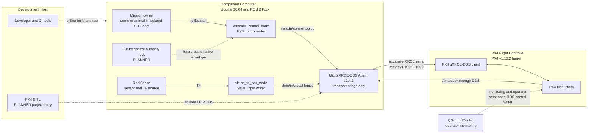

# BoomBoomFly 系统架构总览

> 文档状态：`STATICALLY_VERIFIED`
> 当前事实源：本仓库 `master@5a0e6edd4930474506a1046d414425893ebd800f`
> 核对日期：2026-07-26（Asia/Shanghai）
> production：`BLOCKED`

本文描述当前 checkout 中可见的组件和已经冻结的架构决策，不授予启动、硬件访问或飞行权限。历史审查中的旧分支、旧 HEAD、设备枚举和 PX4 参数快照只属于 `HISTORICAL_EVIDENCE`。

## 1. 基线与状态词

| 项目 | 当前架构基线 | 状态 |
|---|---|---|
| Companion OS | Ubuntu 20.04 | `HISTORICAL_EVIDENCE`（本轮未动态核验主机） |
| ROS | ROS 2 Foxy | `HISTORICAL_EVIDENCE`（本轮未动态核验安装） |
| PX4 目标版本 | PX4 v1.16.2 / PX4 FMUv3 | `HISTORICAL_EVIDENCE`；当前 binary 与参数未复验 |
| ROS/PX4 transport | PX4 uXRCE-DDS-only | `IMPLEMENTED`（架构决策）；运行 profile `BLOCKED` |
| Agent | Micro XRCE-DDS Agent v2.4.2（lock） | `STATICALLY_VERIFIED`；本轮未启动 |
| 消息集 | `px4_msgs` v1.16.2（lock） | `STATICALLY_VERIFIED` |
| 运行拓扑 | 单 PX4、根 namespace `/` | `IMPLEMENTED`（架构决策） |
| MAVROS | 不属于 production、bench、SITL 或 read-only baseline | `BLOCKED`（禁止路径） |
| production | 禁用 | `BLOCKED` |

本文仅使用项目规定的状态枚举：`IMPLEMENTED`、`PARTIALLY_IMPLEMENTED`、`STATICALLY_VERIFIED`、`UNIT_TESTED`、`SITL_VERIFIED`、`BENCH_VERIFIED`、`FLIGHT_VERIFIED`、`HISTORICAL_EVIDENCE`、`PLANNED`、`BLOCKED`、`UNVERIFIED`。

## 2. 当前目标架构



图中实线表示源码存在或架构冻结的链路，不等于本轮已运行验证。`Future control-authority node` 是 `PLANNED`，当前仓库没有其实现。QGroundControl 的具体物理链路和当前可用性为 `UNVERIFIED`，不得占用 DDS 专用 TELEM2 串口。

## 3. 四类路径

### 3.1 当前 production baseline

唯一候选链路是：

```text
ROS 2 nodes <-> Micro XRCE-DDS Agent <-> PX4 uXRCE-DDS client
```

- `/offboard_control_node` 是 trajectory setpoint、Offboard mode 和 VehicleCommand 的唯一允许 ROS writer。
- `/vision_to_dds_node` 是外部视觉和可选精降目标的唯一允许 ROS writer。
- `/fmu/out/*` 的权威来源只能是目标 PX4 经 Agent 转发的数据。
- 每个 profile 最多一个 Agent、一个 Offboard writer、一个视觉 writer和一个 mission owner。
- baseline 默认不启用 precision landing。
- 该目标架构的 production 状态仍是 `BLOCKED`，不是已获准运行的 production 系统。

### 3.2 开发路径

| 路径 | 允许用途 | 当前状态 |
|---|---|---|
| `offline-static` | 文件、manifest、文档、静态 launch 检查 | `IMPLEMENTED` |
| isolated build/unit test | 在隔离输出目录构建与测试核心包 | `HISTORICAL_EVIDENCE`；本轮未复跑 |
| `sensor-isolated` | 不连接 `/fmu/in/*` 的单传感器/TF 验证 | `PLANNED` |
| `px4-read-only` | 单 Agent + PX4 telemetry observer | `HISTORICAL_EVIDENCE`；每次仍需授权 |
| `sitl-dds` | PX4 SITL、单 Agent、受控 writer | `PLANNED`；项目级入口尚缺 |
| `bench-dds` | 拆桨、隔离台架逐门放行 | `UNVERIFIED` 且 `BLOCKED` |

开发路径必须使用隔离 ROS domain 或明确测试 namespace，不能与真实 Agent/PX4 graph 混合。mock 数据只允许隔离测试，不能作为 SITL、台架或实机权威来源。

### 3.3 历史路径

- `src/px4_bringup`、MAVROS、旧 serial、`vision_to_mavros` 和旧硬件组合 launch 是历史源码或排除项。
- `offboard_swarm_control.launch.py` 是历史/实验入口，不能证明多机能力。
- `offboard_cpp/README.md` 中 PX4 1.14.3、MAVROS/蜂群和烧录说明不是当前 PX4 v1.16.2 DDS-only 权威运行说明。
- 2026-07-24 PX4 参数快照和 2026-07-25 实机 DDS session 是 `HISTORICAL_EVIDENCE`，不是当前参数或本轮运行结果。

历史路径可以只读审计，不能被 production profile、批准 launch 或验收证据引用为当前实现。

### 3.4 禁止路径

- MAVROS/MAVLink 作为 production fallback，或与 DDS 同时复用 TELEM2。
- `px4_bringup` 旧入口、`vision_to_mavros`、mock RC、demo/animal mission owner 出现在 production graph。
- 多个 Offboard、视觉、Agent 或 mission owner 实例连接同一目标 PX4。
- 在 production 中运行 swarm launch 或使用 `/drone1` 等 namespace。
- 在未完成安全门时启动真实控制 writer、arm、切 mode 或发布 `/fmu/in/*`。

## 4. Transport 与资源所有权

`/dev/ttyTHS0:921600` 是目标架构中的 PX4 uXRCE-DDS transport。它必须由与目标 PX4 对应的单一 Micro XRCE-DDS Agent 独占：

```mermaid
flowchart LR
  Port[/dev/ttyTHS0:921600]
  Agent[one Micro XRCE-DDS Agent]
  PX4[PX4 uXRCE-DDS client]
  MAVROS[MAVROS or MAVLink process]
  Other[serial or legacy bringup]

  Agent <-->|allowed exclusive owner| Port
  Port <--> PX4
  MAVROS -. BLOCKED .-> Port
  Other -. BLOCKED .-> Port
```

Agent 只是字节流/DDS bridge，不是 mission owner，也不授予命令权限。Agent restart、端口冲突、identity/domain 不一致时的运行时 fail-closed guard 尚未实现：`PLANNED`。

## 5. 控制、感知与 operator 边界

| 边界 | 责任 | 不承担的责任 | 状态 |
|---|---|---|---|
| Mission owner | 产生任务层 `/offboard/*` 意图 | 不直接写 `/fmu/in/*` | 当前 demo/animal `PARTIALLY_IMPLEMENTED`；正式 owner `PLANNED` |
| Offboard | 校验任务意图并成为三个 PX4 控制输入的唯一 writer | 不拥有 transport 或视觉数据 | 节点 `IMPLEMENTED`；安全闭环 `PARTIALLY_IMPLEMENTED` |
| Vision bridge | 将健康、已验证的 TF/视觉转换为 PX4 消息 | 不发布 mode、arm 或 trajectory | 基础节点 `IMPLEMENTED`；坐标/时间健康门 `BLOCKED` |
| Agent | ROS DDS 与 PX4 XRCE transport bridge | 不仲裁 mission 或控制 | 源码/版本 `STATICALLY_VERIFIED`；运行 `UNVERIFIED` |
| PX4 | 飞行控制、状态和反馈的权威端 | 不接受第二条 production ROS/MAVROS 控制链 | 目标 v1.16.2 `HISTORICAL_EVIDENCE` |
| QGroundControl/operator | 监控、人工确认和未来获批操作 | 不作为 ROS `/fmu/in/*` writer，不复用 TELEM2 | 当前连接与配置 `UNVERIFIED` |

## 6. 单机限制与未来多机

当前只批准根 namespace：`/fmu/in/*`、`/fmu/out/*`、`/offboard/*`。这是单 PX4、单 Agent、单 writer 集合的限制。仓库存在生成 `/drone1`、`/drone2`、`/drone3` 的 launch 源码，但缺少每机 client key、Agent、domain、transport、system identity、owner 和不可达性契约，因此多机为 `BLOCKED`。

未来多机必须另立 ADR，明确每机 namespace、PX4 client identity、DDS domain/Agent/port、唯一 control/vision owner，以及跨机命令不可达的 SITL 与台架证据；不能从现有 swarm launch 推断为已实现。

## 7. Production 阻塞摘要

以下能力均未完成，因此 production 保持 `BLOCKED`：

- graph guard：`PLANNED`
- owner/lease/sequence/arbiter：`PLANNED`
- VehicleCommand ACK 事务与 fresh VehicleStatus：`PLANNED`
- 显式 WAIT/PRESTREAM/ACTIVE 安全协议：`PLANNED`
- `/fmu/out/rc_channels` 定制 PX4 firmware profile：`BLOCKED`
- 统一 freshness、fault lattice、restart/epoch 处理：`PLANNED`
- 外部视觉坐标、时间、质量与 reset 契约：`BLOCKED`
- PX4 DDS SITL、拆桨台架和有限实机：分别 `PLANNED`、`UNVERIFIED`、`UNVERIFIED`

## 8. 权威参考

- [控制权矩阵](../CONTROL_AUTHORITY_MATRIX.md)
- [ADR-0001：DDS-only 控制权](../adr/0001-dds-only-control-authority.md)
- [部署拓扑](DEPLOYMENT_TOPOLOGY.md)
- [节点清单](NODE_INVENTORY.md)
- [数据流](DATA_FLOW.md)
