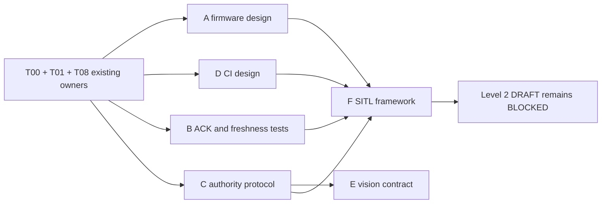

# BBF-DOC-WAVE 下一阶段工作安排建议

> 文档状态：`PLANNED`
>
> 基线：`master@5a0e6edd4930474506a1046d414425893ebd800f`
>
> 本报告只分配建议，不授权修改、运行硬件或启用 production。

## 1. 调度原则

- T00（工作区/dirty/toolchain）、T01（DDS-only package/launch 边界）和 T08（evidence/release/rollback schema）由现有人员继续负责；新工作线不得修改其脚本、allowlist、schema 或 receipt。
- 所有功能实现都从独立分支和互斥文件所有权开始；共享接口先评审、后并行实现。
- 所有 P0 关闭且 Level 1 `SITL_VERIFIED` 前禁止拆桨台架；实机控制永远需要另行授权。
- production 当前 `BLOCKED`；MAVROS 不是 fallback；`/dev/ttyTHS0` 仅 DDS transport 独占。

## 2. 工作线 A：PX4 firmware profile

| 字段 | 建议 |
|---|---|
| 前置条件 | T00 锁定 PX4 v1.16.2 source/submodule/toolchain；T08 schema 可用；T01 边界稳定 |
| 是否可立即开始 | 仅 source/message/profile 设计可开始；构建与验收在前置完成前 `BLOCKED` |
| 冲突文件 | PX4 `dds_topics.yaml`、PX4 source lock/profile、T00 toolchain 文件、T08 evidence schema |
| 建议并行度 | 2：消息/profile 对齐与验收断言设计；最终 patch/generation/SITL/FMUV3 串行 |
| 禁止并行 | 同时编辑同一 PX4 profile；SITL 早于静态生成；FMUv3 promotion 早于 SITL；任何刷写 |
| 预计输出 | 最小 `rc_channels` patch、生成检查、PX4-source SITL payload、FMUv3 artifact SHA-256/资源余量 |
| 验收门 | topic/type/QoS 唯一 PX4 writer；baseline 不加入 precision landing；完整 provenance |
| 允许修改功能包 | 否；可在独立 PX4 profile 工作区修改 PX4 配置，范围需另行批准 |
| 需要硬件授权 | 软件构建/SITL 否；访问/刷写飞控是，且本阶段禁止 |

## 3. 工作线 B：Offboard ACK/freshness/PRESTREAM

| 字段 | 建议 |
|---|---|
| 前置条件 | T01 受控 build；ACK/topic 协议评审；工作线 A 的 SITL profile 用于集成验收 |
| 是否可立即开始 | 纯单元设计与失败测试可以；SITL acceptance 不可以 |
| 冲突文件 | `src/offboard_cpp` node/FSM/input/topics/config/test；与工作线 C 的输入接口交汇 |
| 建议并行度 | 2：typed freshness/epoch wrapper 与 ACK transaction tests；FSM 集成串行 |
| 禁止并行 | 多人同时编辑 FSM/node；在 owner envelope 未冻结时修改同一内部 topic；与工作线 C 无接口合约并行合并 |
| 预计输出 | ACK pending/result/correlation、fresh status、初始化修复、WAIT_INPUTS/PRESTREAM/MODE_PENDING、单元测试 |
| 验收门 | ready 前 0 control publish；不少于 1 s/20 个有效样本；仅 ACCEPTED + fresh status 迁移 |
| 允许修改功能包 | 是，仅经专项授权的 `src/offboard_cpp` 任务 |
| 需要硬件授权 | 单元/SITL 否；台架/实机是 |

## 4. 工作线 C：owner/lease/graph guard

| 字段 | 建议 |
|---|---|
| 前置条件 | T01 profile/launch 边界；authority 协议 ADR 评审；与工作线 B 冻结 command envelope 接口 |
| 是否可立即开始 | 协议和 graph test 设计可以；集成在接口冻结前 `BLOCKED` |
| 冲突文件 | 新 arbiter 包、Offboard internal topic/input、production launcher；与 B/F 共享接口/测试 orchestration |
| 建议并行度 | 3：协议、graph guard、lease fault tests；集成串行 |
| 禁止并行 | 两套 arbiter/envelope；多个团队同时改变 `/offboard/*`；guard 与 launcher 未约定时分别合并 |
| 预计输出 | owner/lease/sequence/epoch envelope、持续 graph guard、结构化拒绝原因和 fault tests |
| 验收门 | 非当前/旧/乱序/重复 lease 对 PX4 publish count 为 0；冲突锁存且人工恢复 |
| 允许修改功能包 | 是，仅在新包/Offboard 边界获专项授权后 |
| 需要硬件授权 | 单元/SITL 否；台架/实机是 |

## 5. 工作线 D：CI 和质量门

| 字段 | 建议 |
|---|---|
| 前置条件 | T00 toolchain identity；T01 权威 package/build entry；T08 evidence 字段 |
| 是否可立即开始 | 设计可以；workflow 修改属于既有 T00/T01/T08 外的独立授权任务 |
| 冲突文件 | `.github/workflows/**`、CI scripts/config；不得与 T01 同改 build/allowlist |
| 建议并行度 | 3：manifest/boundary、build/test、lint/security jobs |
| 禁止并行 | 同一 workflow 文件并发编辑；用 moving latest；为绿色放宽测试；未经授权修改远端 ruleset |
| 预计输出 | required CI 候选、固定环境、负向测试、artifact/log/SBOM hash |
| 验收门 | 故意破坏 allowlist/topic/test/lint 时 job 非零；相同 source/toolchain 可复现 |
| 允许修改功能包 | 默认否；lint 修复须另分功能包 owner 任务 |
| 需要硬件授权 | 否；CI 禁止连接硬件 |

## 6. 工作线 E：视觉坐标和时间契约

| 字段 | 建议 |
|---|---|
| 前置条件 | T01 包边界；工作线 C 的 profile/authority 接口冻结；上游 frame 输入契约确定 |
| 是否可立即开始 | ADR、纯函数规范和离线金样测试设计可以 |
| 冲突文件 | `src/vision_to_dds`、坐标/时间 ADR、sensor profile；不得与设备 profile 同时改转换核心 |
| 建议并行度 | 2：坐标数学与 timestamp/reset/quality tests；集成串行 |
| 禁止并行 | 未冻结 frame 就改转换；普通视觉与 precision landing 同时启用；历史参数代替当前 preflight |
| 预计输出 | ENU/NED/FLU/FRD 契约、纯函数、golden tests、freeze/reset/quality/freshness health |
| 验收门 | axis/90/180/quaternion/covariance 通过；异常 time/frame/non-finite 对 PX4 publish count 为 0 |
| 允许修改功能包 | 是，仅经专项授权的 `src/vision_to_dds` 任务 |
| 需要硬件授权 | 离线/SITL 否；传感器、EKF2 当前参数和实机是 |

## 7. 工作线 F：SITL 验收框架

| 字段 | 建议 |
|---|---|
| 前置条件 | 工作线 A firmware profile；B/C 安全接口；D CI 基线；T08 schema |
| 是否可立即开始 | 场景/断言设计可以；可执行 orchestration 在依赖完成前 `BLOCKED` |
| 冲突文件 | SITL scripts/launch/orchestration、CI job、evidence adapter；不得修改 T08 schema |
| 建议并行度 | 3：正常场景、故障场景、event/evidence parser；基础 orchestration 先冻结 |
| 禁止并行 | 用 mock 替代 PX4 contract；不同团队同时改主 orchestration；早于 A/B/C 运行 promotion suite |
| 预计输出 | 固定 source/domain/client identity 的 SITL 入口、topic/QoS/source checks、正常/故障矩阵、timeline |
| 验收门 | 每个场景可重复且 bounded timeout；PX4 publisher identity 可证明；失败阻止 promotion |
| 允许修改功能包 | 通常否；测试 hook 若需功能包修改必须转交对应 B/C/E owner |
| 需要硬件授权 | 否；必须保证不访问真实设备 |

## 8. 推荐启动波次

下一批建议优先启动 A 的离线 profile 设计、B 的失败测试、C 的协议 ADR、D 的 CI 设计；共享接口评审后再进入代码集成。E 可在 C 的接口冻结后开始。F 的场景设计可先行，但运行验收必须等待 A/B/C/D 和 T08。任何 Level 2/3 工作都不能由该图自动授权。
