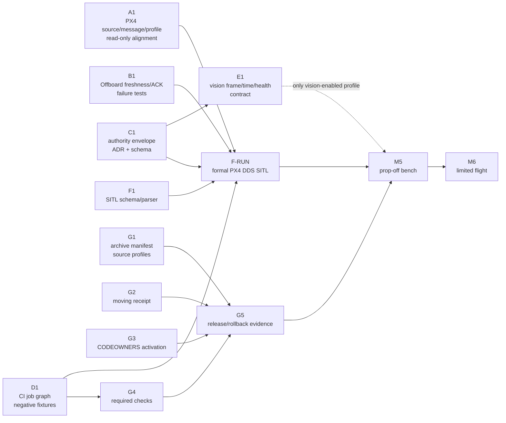

# BoomBoomFly 工作线依赖图

> 文档状态：`PLANNED`
>
> 调度基线：Repository Cleanup Wave 2 起始
> `master@0a7f90dad0942843c989a9bed6333a88f9b31ca5`。箭头 `X --> Y`
> 表示 Y 的集成或验收依赖 X；纯只读审查、ADR、schema 和失败测试只有在不写共享
> 文件时才可提前。

## A–G 工作线



立即推荐启动 A1、B1、C1、D1、G1。E1 必须等待 C1 的 authority/profile
接口冻结。F1 的 schema、catalog、parser 和离线负向测试可以继续，但 F-RUN 正式
SITL 必须等待 A、B、C、D 的适用门通过；F1 完成不等于 `SITL_VERIFIED`。

## 与 backlog 的映射

| 工作线 | 主任务 | 依赖的 backlog |
|---|---|---|
| A | PX4 v1.16.2 `rc_channels` firmware profile | `BBF-TASK-012`、`016`、`018` |
| B | Offboard ACK、freshness、PRESTREAM | `BBF-TASK-003`、`004`、`006` |
| C | owner、lease、graph guard | `BBF-TASK-001`、`002`、`017`、`018` |
| D | CI 与质量门 | `BBF-TASK-013` |
| E | 视觉坐标、时间和 health contract | `BBF-TASK-008`、`009`、`022`、`023` |
| F | SITL acceptance framework | `BBF-TASK-014`、`015`、`016` |
| G | repository dependency/release hygiene | `BBF-TASK-025`–`029` |

## 硬依赖

| 后续门 | 必须先完成 |
|---|---|
| A 的生成/build/SITL/FMUV3 artifact | approved PX4 v1.16.2 exact source、recursive submodule、toolchain lock |
| B 的 FSM 集成 | ACK/epoch/freshness 契约和 C 的 consumer boundary 冻结 |
| C 的 Offboard adapter | authority ADR/envelope schema 通过，B/C 唯一 writer 协调完成 |
| D 的可复现 CI promotion | runner/toolchain 固定，T00/T01/T08 现有门如实运行 |
| E 的 publisher/profile 集成 | C 的 authority/profile 接口冻结；frame/time ADR 通过 |
| F-RUN | A firmware/profile、B/C 软件门、D CI gate 全部通过 |
| G archive 实施 | 维护者批准 manifest 迁移；active/archive/optional profile 负向测试先通过 |
| G moving receipt | 维护者确认 `../communication` dirty/untracked 内容归属与签名身份 |
| G CODEOWNERS | 真实 GitHub user/team；当前 proposal 不可直接启用 |
| G required checks | D jobs 稳定通过和仓库管理员授权 |
| M5 拆桨台架 | 全部适用 P0/P1、F-RUN、release/rollback evidence 和单独硬件授权 |
| M6 有限飞行 | M5 通过、独立风险评估和飞行授权 |

## 禁止并行写入

| 冲突组 | 唯一 writer 规则 |
|---|---|
| PX4 `dds_topics.yaml`、source/profile lock、generator output | A 独占；F 只消费 endpoint manifest |
| `src/offboard_cpp` FSM/node/input/topic/config | B 独占核心事务文件；C 先写独立 ADR/schema，adapter 串行合并 |
| authority schema、arbiter、graph guard、production launcher | C 独占；E/F 只消费冻结接口 |
| `.github/workflows/**` 与 CI scripts/config | D 独占；G 只管理获批后的 remote required-check 设置/evidence |
| `src/vision_to_dds` 转换、time/health、sensor profile | E 独占；precision landing 另行串行 |
| SITL scenarios/catalog/parser/orchestration | F 独占；不得反向修改 A–E 实现以迁就测试 |
| `workspace*.repos`、manifest/source-profile validator | G 独占；不得修改任何 nested dependency checkout |
| evidence/receipt/schema 基础设施 | 遵守 T08/G 的单一 owner；既有 dated evidence 不回写 |

## 关键路径

```text
A1 + B1 + C1 + D1 + F1 -> F-RUN -> M5 -> M6
C1 -> E1 -> vision-enabled M5
G1 + G2 + G3 + (D1 -> G4) -> G5 -> M5
```

工作线 G 是 release hygiene 聚合门，不替代 A–F 的技术验收。反过来，A–F 的软件
通过也不能绕过 provenance、review ownership、required checks 和 rollback evidence。

## 当前状态

| 节点 | 状态 | 当前允许动作 |
|---|---|---|
| A1 | `PLANNED` | 只读 source/message/profile inventory；无 PX4 source 时记录 blocker |
| B1 | `PLANNED` | 纯软件失败测试；不得运行 PX4/Agent/硬件 |
| C1 | `PLANNED` | ADR/schema/synthetic fixtures |
| D1 | `PLANNED` | job graph 和负向 fixture 设计；不得改远端 rules |
| E1 | `BLOCKED` | 等待 C1 接口冻结 |
| F1 | `PARTIALLY_IMPLEMENTED` | schema/parser 离线测试可继续 |
| F-RUN | `BLOCKED` | 等待 A–D |
| G1 | `PLANNED` | 设计可开始；迁移需批准 |
| G2 | `BLOCKED` | 等待 moving dirty source 决策 |
| G3 | `BLOCKED` | 等待真实 owner |
| G4 | `BLOCKED` | 等待 D1 与管理员授权 |
| G5 | `BLOCKED` | 等待 G1–G4 |
| M5/M6 | `BLOCKED` | 当前无硬件/飞行授权 |

```text
PRODUCTION: BLOCKED
HARDWARE ACCESS: NOT AUTHORIZED
FIRMWARE FLASH: NOT AUTHORIZED
FLIGHT: NOT AUTHORIZED
```
