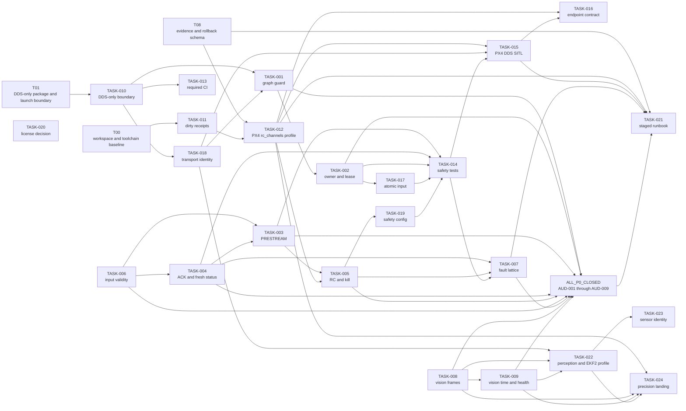
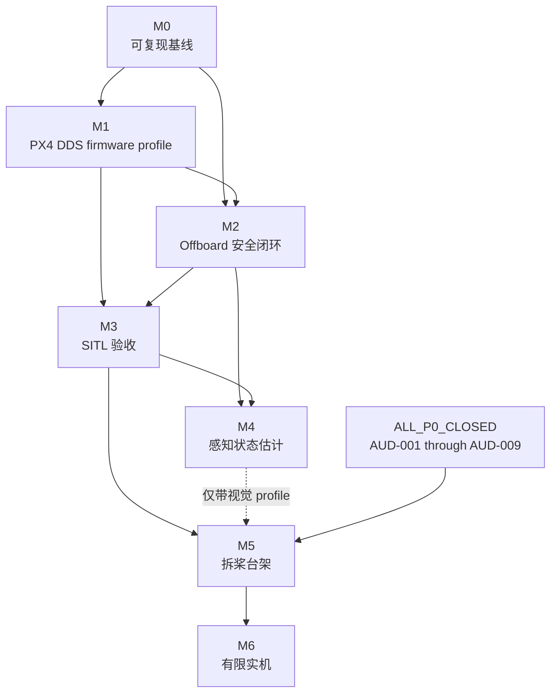

# BoomBoomFly Task Dependency Graph

> 文档状态：`PLANNED`
>
> 图中节点是本地 backlog 项或既有工作线，不代表真实 GitHub Issue。箭头 `A --> B`
> 表示 B 的集成/验收依赖 A；纯设计或失败测试可以在接口冻结后提前并行。

## P0/P1 依赖图



## 里程碑依赖图



虚线表示 M4 只阻塞启用外部视觉的台架/实机 profile；它不授权绕过 M2/M3，也不让
纯 telemetry 台架自动获批。`ALL_P0_CLOSED` 是独立聚合门，覆盖 AUD-001 至 AUD-009，
不能由 M3/M4 的阶段箭头替代。对“启用视觉前”的条件 P0，关闭方式必须是完成验收，
或以静态和运行负向测试证明对应视觉 profile 被机械禁用；仅写“本次不用视觉”不能
满足该门。

## 可并行矩阵

| 波次 | 可并行工作 | 并行前冻结项 | 汇合门 |
|---|---|---|---|
| Wave 0 | T00、T01、T08 | 各自文件所有权 | M0 baseline review |
| Wave 1 | TASK-012 静态生成；TASK-006 validity；TASK-004 ACK 测试；TASK-002 协议；TASK-013 CI 骨架 | endpoint、epoch、authority schema | M1/M2 interface review |
| Wave 2 | TASK-003 PRESTREAM；TASK-001 graph guard；TASK-017 atomic input；TASK-008 frame；TASK-009 time tests | Offboard envelope、profile identity、frame/time ADR | M2 unit gate |
| Wave 3 | TASK-005 RC/kill；TASK-019 safety config；TASK-014 fault tests；TASK-022 perception profile | M1 RC source、M2 interfaces | fault table approval |
| Wave 4 | TASK-015 normal/fault scenarios/reader assertions；TASK-016 endpoint verification | orchestration and event taxonomy | M3 SITL gate |
| Wave 5 | TASK-023 sensor degradation；TASK-024 precision-landing design only；TASK-021 bench checklist preparation | M3 results、M4 ordinary vision status | M4/M5 go/no-go |

“可并行”只表示不同文件或已冻结接口上的工作可以并行；同一实现文件的最终集成仍由
单一 owner 串行完成。

## 禁止并行的关系

| 先行任务 | 禁止并行/提前的后续任务 | 原因 |
|---|---|---|
| T00/T01/T08 | 其他工作线修改其 scripts/schema/receipt/allowlist/evidence 基础设施 | 文件所有权冲突和事实源分叉 |
| TASK-002 / TASK-017 | Offboard 输入接口的两个独立实现 | owner/lease 与 atomic envelope 必须是同一事务协议 |
| TASK-003 / TASK-004 / TASK-006 | 同时改动同一 FSM/input 文件而未冻结接口 | 高概率覆盖 freshness、ACK 和 PRESTREAM 安全条件 |
| TASK-007 | 未经 Safety Reviewer 批准就实现 Land/Position/停止输出策略 | 危险故障动作不可由实现者单独决定 |
| TASK-012 | TASK-015 的 RC/PX4 endpoint 正式验收 | 没有 PX4 source/profile 时 mock 不能代替 |
| TASK-014 | TASK-015 全量故障注入 | 测试 hook、事件码和 bounded timeout 尚未形成 |
| TASK-008 / TASK-009 | TASK-022 的视觉 publisher enable | frame/time 任一未闭合都会产生危险视觉输入 |
| TASK-022 | TASK-023 真实设备验收、TASK-024 精降实现 | 普通视觉 profile 和健康门必须先完成 |
| M3 | M5 实际拆桨台架 | SITL 未过不得 promotion |
| M5 | M6 有限实机 | 台架与实际 rollback 未通过，且实机需另行授权 |

## 关键路径

```text
T00/T08 -> TASK-011 -> TASK-012 -> TASK-015 -> TASK-021 -> M5 -> M6
T01 -> TASK-010 -> TASK-018 -> TASK-001 -> TASK-002 -> TASK-017
TASK-006 -> TASK-004 -> TASK-003 -> TASK-005 -> TASK-007
上述控制链 -> TASK-014 -> TASK-015
TASK-008 -> TASK-009 -> TASK-022 -> TASK-023
```

最长安全关键路径是 firmware 权威 RC source、Offboard 安全闭环和 SITL 验收三条链的
汇合；排期不得用文档完成或 mock 测试替代其中任一运行门。
