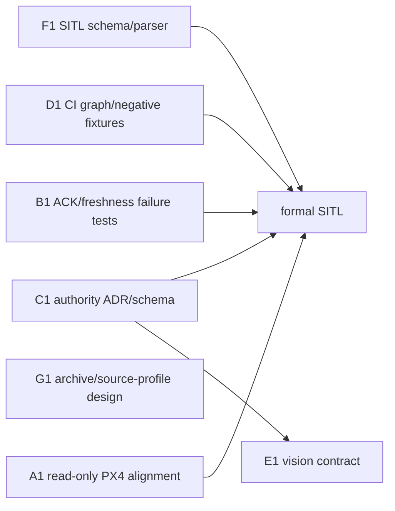

# 下一波并行任务

> Canonical planning document
> 当前调度基线：Wave 3B 起始
> `agent/wave3a-software-gates@afb4fdcecb22596056432492d1ad284919b065cd`；
> root 工作分支 `agent/wave3b-integration-gates`，nested Offboard 已固定为
> `agent/wave3b-offboard-integration@976d6217d73a28b72e64300e2dd04bcbeeee30d7`。

本文件直接替代旧调度内容；不创建重复的 `NEXT_PARALLEL_TASKS_V2.md`。任务授权只限
各自明确写入范围。任何 task 的 `PLANNED`、schema、mock 或离线测试结果都不能提升为
SITL、台架、飞行或 production 证据。

## Wave 3B authoritative refresh

Wave 3B dated audit 位于
[`2026-07-27-wave3b`](../audits/2026-07-27-wave3b/)。本节在冲突处取代下方
Wave 3A 任务快照；下方保留为历史分工和 ownership 参考。

- A2：`BLOCKED`，缺 exact PX4-Autopilot source、recursive submodules、DDS
  generator/profile、immutable ARM toolchain 和 board lock。
- B2/C2：冻结 `boom-boom-fly.authority-envelope/1.0.0` 后，纯软件 authority 与
  Offboard runtime contract `PASS`；live node/publisher wiring 尚未验证。
- D2：本地 manual/non-required workflow 与 7 个稳定 job 静态 `PASS`；8 个 immutable
  lock 未闭合，runner execution exit 78 fail closed。
- G2：active/archive/optional migration 与 15 tests `PASS`；serial canonical path
  仍 `REQUIRES_MAINTAINER_DECISION`，DDS wrapper 在受保护 path conflict exit 2。
- F2：37-scenario catalog、27 tests、16-record/29-assertion synthetic timeline
  `PASS`；不能提升为 formal SITL。
- H0/H1：软件门未全通过，当前 checklist 为 `NO-GO`，没有请求或收到人工 GO。

下一波只允许关闭以下软件 blocker：导入获批 exact PX4/toolchain、发布并锁定可恢复的
Offboard commit、把已测 gate 串入 live node/publisher、维护者决定 serial canonical
source/path、提供 immutable CI dependency bundle。完成后先重跑完整离线门；不得直接
进入 formal SITL、armed bench 或 flight。

## Wave 3A 状态刷新

2026-07-27 的 canonical 离线验证在上述 root 基线和受保护 dirty checkout 上执行：
root 115 tests 与 B1 嵌套仓库 12 tests 全部通过。A1 的只读 alignment 已完成但因
PX4-Autopilot source/toolchain 缺失保持 `BLOCKED`；B1、C1、D1、G1 仅达到各自
test-only/schema/design oracle 的 `UNIT_TESTED`。对应 dated audit 位于
[`2026-07-27-wave3a`](../audits/2026-07-27-wave3a/)。

Wave 3A 尚未退出：A1 blocker 未关闭，B/C 的 production runtime integration 尚未
实施，D1 executable workflow 和 G1 manifest migration 均未授权，且 ADR-0002 仍为
`Proposed`。下一步是维护者评审/冻结共享接口，并为 A1 提供获批的 exact
PX4 source/submodule/toolchain identity；不得自动进入 formal SITL 或 hardware。

## 执行顺序

下一波立即启动 A1、B1、C1、D1、G1，且必须使用互斥 writer：



E1 在 C1 的 authority/profile 接口冻结后开始。F1 可继续离线工作；formal SITL
必须等待 A、B、C、D。

## A1 — PX4 source/message/profile 只读对齐

| 字段 | 内容 |
|---|---|
| ID | `A1` / `BBF-TASK-012` 前置 |
| owner | PX4 Maintainer；Release Maintainer 复核 provenance |
| 唯一写入范围 | 新 dated alignment report 和明确批准的 PX4 source/profile lock proposal；A1 默认只读，不修改 PX4、nested repos 或 root manifests |
| 前置依赖 | 当前 `px4_msgs@392e831c…`；PX4 v1.16.2 source origin/commit、recursive submodules 和 toolchain 如缺失必须记录 blocker |
| 可否立即开始 | 是，仅只读 inventory/alignment；生成、build、SITL 和 FMUv3 promotion 尚不可开始 |
| 禁止并行修改的文件 | PX4 `dds_topics.yaml`、message generator 配置、source/submodule/toolchain lock；后续一旦获批由 A 唯一 writer |
| 输入 | `px4_msgs/RcChannels.msg`、PX4 v1.16.2 message/profile（若可用）、现有 endpoint/profile 文档、环境 blocker |
| 输出 | 字段级对照、topic/type/QoS 预期、最小 `rc_channels` profile diff 设计、缺失 source/toolchain 清单 |
| 验收门 | exact source/message identity 可追溯；差异逐字段解释；baseline 不引入 precision-landing topic；无 source 时诚实 `BLOCKED` |
| 状态 | `BLOCKED`；只读 alignment 已完成，实施/运行等待 exact PX4 source/submodule/toolchain identity |
| 是否需要硬件授权 | 否；硬件、串口、刷写和参数操作禁止 |

## B1 — Offboard freshness/ACK 失败测试

| 字段 | 内容 |
|---|---|
| ID | `B1` / `BBF-TASK-003`、`004`、`006` |
| owner | Control Maintainer；Safety Reviewer 复核 fail-closed assertions |
| 唯一写入范围 | 获批任务内的 `src/offboard_cpp/test/**` 和随后串行合并的 freshness/ACK supporting source；不得修改 root boundary/profile |
| 前置依赖 | T01 DDS-only build/test entry；ACK result/correlation、PX4 reboot epoch、clock/freshness 语义；与 C1 冻结 consumer boundary |
| 可否立即开始 | 是，先写失败的表驱动纯软件测试；SITL 不可开始 |
| 禁止并行修改的文件 | `src/offboard_cpp` 的 FSM/node/input/topic/config 文件；B 为核心事务唯一 writer，C 不得并发写同一文件 |
| 输入 | `VehicleCommandAck`/`VehicleStatus` 消息契约、现有 Offboard FSM、DDS-only package profile |
| 输出 | ACK 全 result/timeout/correlation 失败测试，首帧/stale/reboot/clock 测试，PRESTREAM 连续性断言 |
| 验收门 | readiness 前 `/fmu/in/*` publish count 为 0；至少 1 s 且 20 个有效样本；只有正确 ACCEPTED ACK + fresh status 才迁移；拒绝/迟到/错 target/旧 epoch 均 fail closed |
| 状态 | `UNIT_TESTED`（test-only contract oracle，12 tests）；production FSM integration 与 SITL `BLOCKED` |
| 是否需要硬件授权 | 否；不得启动 Agent/PX4/hardware launch |

## C1 — authority envelope ADR 与 schema

| 字段 | 内容 |
|---|---|
| ID | `C1` / `BBF-TASK-001`、`002`、`017`、`018` 前置 |
| owner | Architecture/Control Maintainer；Safety Reviewer 批准恢复语义 |
| 唯一写入范围 | 新 authority ADR、machine-readable envelope schema、独立 schema tests；不修改 `src/offboard_cpp` 核心 FSM |
| 前置依赖 | accepted DDS-only control-authority ADR、package/launch boundary、单机根 namespace；与 B1 确定 consumer boundary |
| 可否立即开始 | 是；ADR/schema/synthetic fixtures 可开始，runtime integration 等接口冻结 |
| 禁止并行修改的文件 | authority ADR/schema、arbiter package、production launcher 和 Offboard consumer adapter；同一时刻分别只有 C 或约定 integration owner 可写 |
| 输入 | control authority matrix、owner/lease/sequence/deadline/epoch 需求、ROS graph transient 风险 |
| 输出 | 原子 command envelope、lease lifecycle、持续 graph cardinality/identity contract、稳定拒绝事件码、人工恢复规则 |
| 验收门 | 非当前/旧/重复/乱序/过期 envelope 到 PX4 publish count 为 0；重复 writer/owner、重连和 graph epoch 变化锁存 fail closed；恢复不自动 ACTIVE |
| 状态 | `UNIT_TESTED`（schema/semantic synthetic oracle，19 tests）；ADR `Proposed`，runtime integration `BLOCKED` |
| 是否需要硬件授权 | 否；只允许 ADR/schema/synthetic tests |

## D1 — CI job graph 与负向 fixture 设计

| 字段 | 内容 |
|---|---|
| ID | `D1` / `BBF-TASK-013` |
| owner | Release/CI Maintainer；各领域 owner 负责其 job |
| 唯一写入范围 | 获批后的 `.github/workflows/**`、CI-only scripts/config 和 CI fixtures；远端 ruleset 不在 D1 写入范围 |
| 前置依赖 | T00 environment/toolchain identity、T01 authoritative build/test boundary、T08 evidence artifact fields |
| 可否立即开始 | 是，先做 job graph、版本固定方案和负向 fixtures；未锁 runner 时不得宣称可复现 CI |
| 禁止并行修改的文件 | 同一 workflow、CI config、quality baseline；不得并发修改 T00/T01/T08 所有文件 |
| 输入 | 当前离线 test/validator 入口、runner/Foxy/aarch64 约束、已知 dirty/approval blockers |
| 输出 | manifest/schema、unit/static、DDS-only build/test、docs/link、secret/license jobs；负向 fixture 和 artifact retention 设计 |
| 验收门 | 故意破坏 manifest/profile/topic/link/schema/test/secret fixture 均非零；依赖固定；当前 blocker 可见；不通过放宽测试换绿 |
| 状态 | `UNIT_TESTED`（design-only oracle/negative fixtures，8 tests）；workflow 与 required-check 启用 `BLOCKED` |
| 是否需要硬件授权 | 否；runner 不得连接硬件；远端 required checks 另需管理员授权 |

## E1 — 视觉坐标、时间与 health contract

| 字段 | 内容 |
|---|---|
| ID | `E1` / `BBF-TASK-008`、`009`、`022` |
| owner | Perception Maintainer；PX4 Maintainer/Safety Reviewer 联审 |
| 唯一写入范围 | `src/vision_to_dds` 的纯转换/time-health source/tests、对应 ADR 和 perception profile；不修改 authority schema |
| 前置依赖 | C1 authority/profile interface 已冻结；上游 frame/安装外参契约由维护者确认 |
| 可否立即开始 | 否；状态 `BLOCKED` 于 C1。冻结后可先离线纯函数/金样 |
| 禁止并行修改的文件 | `src/vision_to_dds` conversion/publisher/time-health 文件、frame/time ADR、sensor profile；普通视觉和 precision landing 不得并发集成 |
| 输入 | C1 profile/authority interface、PX4 `VehicleOdometry` 契约、明确的 ENU/NED/FLU/FRD 和时钟域 |
| 输出 | frame/quaternion/covariance 规范与金样，sample/publish time、epoch/reset/quality/freshness health gate |
| 验收门 | axis/90°/180°/quaternion/covariance 金样通过；frame mismatch、zero/backward/future/freeze/reset/non-finite 输入 publish count 为 0 |
| 状态 | `BLOCKED` |
| 是否需要硬件授权 | 离线/SITL 不需要；真实传感器、PX4 参数/EKF2 和台架需要单独授权，当前未授权 |

## F1 — SITL scenario schema/parser

| 字段 | 内容 |
|---|---|
| ID | `F1` / `BBF-TASK-014`、`015`、`016` 的离线部分 |
| owner | Integration/Test Maintainer |
| 唯一写入范围 | `tools/sitl_acceptance/**`、`test/sitl_acceptance/**`、`docs/verification/**`、SITL catalog/scenario 文件；不修改 A–E 功能实现 |
| 前置依赖 | 现有 scenario/event/timeline/catalog schema；formal run 另依赖 A–D |
| 可否立即开始 | 是，仅 schema/catalog/parser、bounded timeout 和离线负向测试 |
| 禁止并行修改的文件 | 主 orchestration、scenario catalog、event taxonomy、CI SITL job；接口变化由 F 消费，不得复制 A/B/C 常量 |
| 输入 | 当前 SITL acceptance specification、A endpoint proposal、B/C event contract、D artifact fields |
| 输出 | 一一对应 catalog/scenarios、严格 parser、source identity assertions、正常/故障 timeline fixtures |
| 验收门 | JSON/YAML/schema 可解析；无 duplicate/orphan scenario；失败/超时确定非零；mock fixture 明确不能成为 PX4 SITL evidence |
| 状态 | `PARTIALLY_IMPLEMENTED`；离线可继续，formal SITL `BLOCKED` 于 A–D |
| 是否需要硬件授权 | 否；只允许隔离软件，禁止 `/dev` |

## F-RUN — 正式 PX4 DDS SITL

| 字段 | 内容 |
|---|---|
| ID | `F-RUN` / `BBF-TASK-015` |
| owner | Integration/Test Maintainer；PX4/Control/Safety/Release 联合验收 |
| 唯一写入范围 | 经冻结的 SITL orchestration、run artifacts 和新 dated evidence；不得改 A–D 实现以迁就结果 |
| 前置依赖 | A firmware/profile、B ACK/freshness/PRESTREAM、C authority/graph guard、D CI gate 全部通过；F1 parser 稳定 |
| 可否立即开始 | 否 |
| 禁止并行修改的文件 | 主 orchestration、endpoint manifest、scenario catalog；运行时依赖固定，禁止边跑边改 |
| 输入 | exact PX4/Agent/root/dependency/profile/domain identity 和批准 scenario |
| 输出 | PX4 publisher/reader proof、正常/故障 bounded timeline、raw logs、exit status、hashes |
| 验收门 | 所有场景独立可复放；RC/DDS/owner/status/battery loss、ACK result、restart、double writer、time jump、mock 混入按批准动作闭合 |
| 状态 | `BLOCKED` |
| 是否需要硬件授权 | 否；只允许隔离 UDP/domain，不得访问真实串口 |

## G1 — archive manifest 与依赖 source profile 设计

| 字段 | 内容 |
|---|---|
| ID | `G1` / `BBF-TASK-025` |
| owner | Release/Dependency Maintainer |
| 唯一写入范围 | 获批后的 `workspace*.repos`、installer manifest 参数、manifest/source-profile validator/tests 和当前依赖文档；不得修改 nested checkout |
| 前置依赖 | 维护者评审 Wave 2 dependency report；active/archive/optional 分类确认 |
| 可否立即开始 | 是，先做设计和负向测试；实际迁移 `px4_bringup` 需协调/维护者批准 |
| 禁止并行修改的文件 | `workspace.lock.repos`、`workspace.repos`、新 archive/optional manifests、installer manifest parser、对应 validator/tests |
| 输入 | 当前 16-entry exact lock、17-entry moving manifest、DDS-only package profile、`px4_bringup@0fbdcbf…` |
| 输出 | `workspace.archive.repos` 设计、optional perception/navigation source profile、显式 archive installer 参数和 fail-closed validator/test plan |
| 验收门 | default restore 不含 archive/optional；archive 只接受 exact SHA；active/archive 重复、moving archive、URL 不一致非零；package forbidden set 不变 |
| 状态 | `UNIT_TESTED`（synthetic profile oracle，10 tests）；实际 manifest/installer 迁移尚未授权 |
| 是否需要硬件授权 | 否；禁止修改/运行任何 dependency hardware path |

## G2 — moving dependency receipt

| 字段 | 内容 |
|---|---|
| ID | `G2` / `BBF-TASK-026` |
| owner | Release/Dependency Maintainer；communication Maintainer 确认业务用途 |
| 唯一写入范围 | receipt schema/validator/tests 和新 dated receipt；不得修改 `../communication` |
| 前置依赖 | 维护者决定 dirty/untracked 串口实现归属和签名 identity |
| 可否立即开始 | schema/negative fixtures 可开始；current receipt capture 暂不可完成 |
| 禁止并行修改的文件 | moving receipt schema、validator、receipt index；T08/G 单一 owner |
| 输入 | root HEAD、communication origin/HEAD/dirty content/time/purpose/approval |
| 输出 | 可 replay、签名且 fail-closed 的 moving-dependency receipt |
| 验收门 | 缺 checkout、错误 origin/HEAD、dirty 未解释、缺签名或 replay 不一致均拒绝 integration/release |
| 状态 | `BLOCKED` 于维护者决策 |
| 是否需要硬件授权 | 否；不得启动 communication 串口代码 |

## G3 — CODEOWNERS 落地

| 字段 | 内容 |
|---|---|
| ID | `G3` / `BBF-TASK-027` |
| owner | Repository Maintainer |
| 唯一写入范围 | 获批后的 `.github/CODEOWNERS` 和 approval evidence |
| 前置依赖 | 真实 GitHub users/teams、proposal 路径验证和维护者批准 |
| 可否立即开始 | 否；只有 proposal 可审查 |
| 禁止并行修改的文件 | `.github/CODEOWNERS`、CODEOWNERS proposal |
| 输入 | governance proposal、真实 owner IDs、当前 repository path inventory |
| 输出 | GitHub 可解析的 CODEOWNERS 和批准记录 |
| 验收门 | 无占位 owner；关键路径有真实 reviewer；GitHub 解析成功 |
| 状态 | `BLOCKED` |
| 是否需要硬件授权 | 否 |

## G4 — CI required checks

| 字段 | 内容 |
|---|---|
| ID | `G4` / `BBF-TASK-028` |
| owner | Repository Administrator；Release Maintainer 提供 job 名单 |
| 唯一写入范围 | 远端 branch protection/ruleset 和只读 evidence；workflow 仍由 D 独占 |
| 前置依赖 | D1 jobs 固定、稳定通过；管理员明确授权 |
| 可否立即开始 | 否；job-name design 可在 D1 完成 |
| 禁止并行修改的文件 | `.github/workflows/**` 由 D 写；G4 不交叉写 workflow |
| 输入 | approved required job names、default branch/ruleset 当前只读状态 |
| 输出 | required-check configuration 与 API evidence |
| 验收门 | required job 失败阻止 merge；无未经批准 bypass；远端快照与文档一致 |
| 状态 | `BLOCKED` |
| 是否需要硬件授权 | 否；需要远端管理员授权 |

## G5 — release/rollback evidence gate

| 字段 | 内容 |
|---|---|
| ID | `G5` / `BBF-TASK-029` |
| owner | Release Maintainer；Safety Reviewer 复核 promotion/rollback |
| 唯一写入范围 | release/rollback manifests、validators/tests、新 dated evidence/index；历史 evidence 不修改 |
| 前置依赖 | G1、G2、G3、G4 和适用 A–F 软件门 |
| 可否立即开始 | 仅负向 fixture 设计；release promotion 不可开始 |
| 禁止并行修改的文件 | release/rollback schema、index、同一 release manifest；遵守 T08 单一 owner |
| 输入 | source/dependency/toolchain/profile/artifact identities、approvals、known blockers、rollback artifacts |
| 输出 | fail-closed release candidate manifest、software rollback replay 和 promotion decision |
| 验收门 | 缺 identity/approval/rollback 或 blocker 未关闭均非零；软件 rollback 可重复；不改写历史 evidence |
| 状态 | `BLOCKED` |
| 是否需要硬件授权 | 离线不需要；台架/飞行 rollback 需要单独授权，当前未授权 |

## 调度汇合门

| 波次 | 可并行任务 | 退出门 |
|---|---|---|
| Wave 3A | A1、B1、C1、D1、G1 | 已形成 Wave 3B 起点；A blocker 结转，禁止提升为 SITL |
| Wave 3B | A2、B2、C2、D2、F2、G2 | **未退出**：A2/D2 execution/serial package boundary/DDS build 仍 blocked；B/C/F/G static runtime/profile 实现通过 |
| Wave 3C | exact A import、live B/C wiring、immutable D locks、serial maintainer decision | 全量离线门、reproducible restore 和 DDS build 全 PASS |
| Wave 3D | F-RUN、E ordinary-vision SITL（适用时） | M3/M4 `SITL_VERIFIED`；G5 release gate |
| Hardware | M5 拆桨台架、M6 有限飞行 | 当前全部 `BLOCKED`，必须新授权 |

## 统一 no-go

- 任一任务写入不属于自己的文件，或两个 owner 同时修改同一实现/schema/workflow。
- 将 moving ref、dirty/untracked source、历史参数或 mock publisher当作 release/SITL
  identity。
- 为使 CI 或测试通过而放宽 allowlist、安全断言或删除负向 fixture。
- 在 A–D 未通过前运行 formal SITL，或把 F1 parser tests 声称为 PX4 SITL evidence。
- 启动 MAVROS、旧 `px4_bringup`、真实 Agent/Offboard/vision/hardware launch。
- 访问 `/dev/ttyTHS0`、`/dev/ttyACM*`、RealSense、RPLIDAR 或其他真实设备。
- 写参数、刷 firmware、arm、切 mode、发布 `/fmu/in/*` 或申请未经批准的远端规则变更。

```text
PRODUCTION: BLOCKED
PROP-OFF DISARMED BENCH: HUMAN-GATED; CURRENT DECISION NO-GO
PROP-OFF ARMED BENCH: NOT AUTHORIZED
FIRMWARE FLASH: REQUIRES PER-ARTIFACT HUMAN CONFIRMATION
FLIGHT: NOT AUTHORIZED
```
