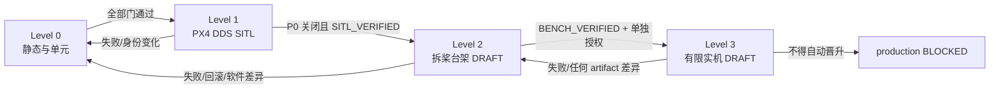

# BoomBoomFly 分级验证门

> 文档状态：`IMPLEMENTED`（流程定义已写入仓库）
>
> 运行状态：Level 0 `UNVERIFIED`；Level 1 `BLOCKED`；Level 2 `UNVERIFIED`；Level 3 `UNVERIFIED`
>
> production：`BLOCKED`

本文定义验证层级和晋升门，不是任何一次测试的 evidence。测试事实只能由对应层级的、绑定源码和产物身份的 evidence 记录证明。2026-07-24 的 PX4 参数文件和 2026-07-25 的真实 DDS session 仅为 `HISTORICAL_EVIDENCE`，不能替代当前参数、当前 checkout 或当前验收。

## 1. 强制状态词

能力、步骤和结果只能使用以下状态：

`IMPLEMENTED`、`PARTIALLY_IMPLEMENTED`、`STATICALLY_VERIFIED`、`UNIT_TESTED`、`SITL_VERIFIED`、`BENCH_VERIFIED`、`FLIGHT_VERIFIED`、`HISTORICAL_EVIDENCE`、`PLANNED`、`BLOCKED`、`UNVERIFIED`。

“runbook 已编写”最多说明文档为 `IMPLEMENTED`，不得提升测试状态。Level 2/3 本轮仅有草案，分别不得标成 `BENCH_VERIFIED` 或 `FLIGHT_VERIFIED`。

## 2. 共同安全边界

- production 当前禁用，只允许 PX4 uXRCE-DDS 控制链；MAVROS 不是 fallback。
- `/dev/ttyTHS0` 只允许 DDS transport 独占，禁止 MAVLink、历史 serial 或第二个 Agent 复用。
- 当前只支持根 namespace `/` 的单机 profile。
- baseline 不启用 precision landing。
- `/fmu/out/rc_channels` 是 Offboard 安全互锁的硬依赖；其 PX4 firmware profile 当前为 `BLOCKED`。
- graph guard、owner/lease、VehicleCommand ACK、显式 PRESTREAM 和 fault lattice 当前未完成；production 为 `BLOCKED`。
- 所有 P0 关闭前禁止进入 Level 2；Level 3 必须在所有适用 P0/P1 关闭、Level 2 实际通过并获得单独书面授权后进行。
- 未经层级授权，不访问硬件、不写参数、不刷 firmware、不 arm、不切 mode、不发布 `/fmu/in/*`。

## 3. 每次验收的共同记录

开始任何层级前创建独立、不可覆盖的验收记录，并至少填写：

| 字段 | 要求 |
|---|---|
| source identity | 根仓库 remote、branch、HEAD、`git status --short`；依赖 lock SHA 与 dirty receipt |
| toolchain identity | OS、架构、ROS 2、RMW、compiler、CMake、Python、colcon、Agent 版本 |
| PX4 identity | PX4 source SHA、递归 submodule、firmware version、board/SITL target、artifact SHA-256 |
| profile identity | profile 名、ROS domain、namespace、client key、Agent transport、system/component identity、配置 hash |
| parameter evidence | 本次适用的只读快照、capture time、firmware identity；历史快照必须标 `HISTORICAL_EVIDENCE` |
| personnel | test director、operator、observer、safety pilot/recorder（按层级适用）及人工确认时间 |
| execution | 每条命令、开始/结束时间、原始退出码、完整日志路径、预期与实际结果 |
| decision | `go` / `no-go`、未决项、风险接受人、下一等级是否获准 |
| rollback | 前一已知良好 source/artifact/profile/参数、触发条件、步骤、结果与签字 |

evidence 的 schema 和 receipt 由独立工作线管理；本文件不定义或修改其格式。schema 未提供时，层级结果保持 `BLOCKED`，不得自建不兼容 receipt 冒充正式证据。

## 4. Level 0：静态检查和单元测试

| 项目 | 要求 |
|---|---|
| 目标 | 在不启动 ROS/PX4/Agent/硬件的条件下证明源码身份、静态契约、构建和单元测试可复现。 |
| 当前状态 | `UNVERIFIED`；历史隔离构建和 Offboard 9/9 gtest 为 `HISTORICAL_EVIDENCE`，不是本轮结果。 |
| 允许操作 | 只读审计、Markdown/配置/launch 静态检查、隔离到 `/tmp` 的 build/test、sanitizer 和纯单元测试。 |
| 禁止操作 | 启动节点/Agent/SITL、访问 `/dev`、参数/firmware 操作、arm/mode/setpoint、把 mock 当集成证据。 |
| 前置条件 | 仓库身份正确；dirty checkout 已记录且不覆盖；DDS-only 包边界生效；测试输出隔离；evidence 入口可用。 |
| 人员角色 | 一名执行者；控制/安全相关变更至少一名独立 reviewer；无需飞手。 |
| 设备状态 | 飞控、动力、电机和传感器均不参与；不得连接作为测试依赖。 |
| 软件版本 | Ubuntu 20.04、ROS 2 Foxy；其余工具从当前 toolchain identity 采集，不使用 moving `latest`。 |
| firmware 版本 | 对涉及 PX4 契约的测试固定 PX4 v1.16.2 source identity；不构建或刷写实机 firmware。 |
| 参数快照 | 不需要当前硬件参数；若用于 fixture，必须标明 synthetic 或 `HISTORICAL_EVIDENCE`，禁止声称 current。 |
| transport 配置 | 无 transport；`ROS_DOMAIN_ID` 和设备路径不得成为 Level 0 外部依赖。 |
| 检查命令 | 仓库 identity/status；受控 DDS-only build/test；lint、schema、静态 launch/graph 断言；`git diff --check`。精确入口由 T00/T01/T08 的权威实现提供。 |
| 预期结果 | 所有 required 检查退出 0；禁止包/launch/writer 注入的负向 fixture 必须非零；源码无意外修改。 |
| go 条件 | required 静态/单元检查全部通过，P0 安全需求均有失败测试，日志和 identity 完整，reviewer 签字。 |
| no-go 条件 | 任一 required check 失败；dirty/HEAD 与记录不符；工具链或依赖无法定位；evidence 缺失。 |
| 立即停止条件 | 检查尝试访问设备、启动硬件链或写工作区禁区；发现测试会发送 `/fmu/in/*`；发现身份漂移。 |
| evidence | 原始命令/退出码、build/test results、静态负向测试、source/toolchain/profile identity、review 结论。 |
| rollback | 删除仅位于隔离输出目录的可再生产物；恢复到前一已知良好依赖/配置需按非破坏流程执行，不 reset/clean 用户树。 |
| 下级入口 | Level 0 全绿；Level 1 firmware/SITL source 和 orchestration 可追溯；所有 Level 1 阻塞有负责人。 |

## 5. Level 1：PX4 DDS SITL

详细步骤见 [SITL 验收](SITL_ACCEPTANCE.md)。

| 项目 | 要求 |
|---|---|
| 目标 | 在隔离 SITL 中证明 PX4 uXRCE-DDS topic/type/QoS、唯一 writer、Offboard 安全状态机和故障响应。 |
| 当前状态 | `BLOCKED`：项目级 SITL 入口、`rc_channels` firmware profile、ACK/freshness/PRESTREAM、owner/lease/graph guard、fault lattice 尚未完成。 |
| 允许操作 | 仅隔离的 PX4 SITL、UDP Agent、单一测试 graph；运行已批准正常/故障场景；保存日志。 |
| 禁止操作 | 真实串口/硬件、MAVROS、mock 冒充 PX4 publisher、刷写、实机参数写入、swarm、precision landing baseline。 |
| 前置条件 | Level 0 通过；PX4 source/submodule/toolchain/profile/evidence schema 已锁；T02–T07 适用输出验收通过。 |
| 人员角色 | test operator、control reviewer、evidence recorder；高风险故障策略需 safety reviewer。 |
| 设备状态 | 无真实飞行器/执行器；SITL 使用隔离网络、domain、临时目录和 bounded timeout。 |
| 软件版本 | Ubuntu 20.04、ROS 2 Foxy、锁定 RMW、Micro XRCE-DDS Agent v2.4.2、锁定被测 checkout。 |
| firmware 版本 | PX4 v1.16.2 锁定 source/profile；记录 SITL binary SHA-256。 |
| 参数快照 | 保存 SITL 参数导出和 hash；不得引用历史实机快照作为 SITL current。 |
| transport 配置 | 单 PX4、单 UDP Agent、单 ROS domain、根 namespace；identity 冲突应 fail-closed。 |
| 检查命令 | 受管 orchestration（当前 `BLOCKED`）；启动后只读 graph/topic/QoS/source/事件检查及批准的故障注入。 |
| 预期结果 | PX4 source 可证明；writer 基数满足矩阵；PRESTREAM、ACK、freshness 和每个故障 deadline 符合批准状态表。 |
| go 条件 | 正常及全部 required 故障场景通过，可重复运行，evidence 完整且 reviewer 无 P0/P1。 |
| no-go 条件 | mock source、未知 publisher、QoS/identity 不符、flaky/超时、缺失场景或证据不完整。 |
| 立即停止条件 | orchestration 触及真实设备；graph 泄漏到非测试 domain；出现不受控进程/重复 writer；日志无法落盘。 |
| evidence | source/binary/profile hashes、端点清单、PX4 payload、事件 timeline、故障注入和 raw logs。 |
| rollback | 停止隔离进程，确认无残留 graph/process；还原临时 profile；保留失败 evidence，不覆盖。 |
| 下级入口 | 所有 P0 关闭；适用 P1 关闭；Level 1 为 `SITL_VERIFIED`；Level 2 草案经安全评审并另行批准。 |

## 6. Level 2：拆桨台架

详细草案见 [拆桨台架验收草案](BENCH_ACCEPTANCE_DRAFT.md)。

| 项目 | 要求 |
|---|---|
| 目标 | 在拆桨、固定、隔离供电的实机台架验证 transport、控制门、执行器响应、停止能力与回滚。 |
| 当前状态 | `UNVERIFIED`；文档为 `DRAFT`，本轮未访问硬件。 |
| 允许操作 | 仅在独立书面授权和批准 test card 范围内逐门执行；默认先只读、disarmed。 |
| 禁止操作 | 安装桨叶、自由机体、单人操作、未批准 arm/mode/输入、MAVROS fallback、串口复用、跳过 Level 1。 |
| 前置条件 | 所有 P0 关闭；适用 P1 关闭；Level 1 `SITL_VERIFIED`；runbook/evidence/rollback 已评审；双人确认。 |
| 人员角色 | test director、operator、observer/safety officer、recorder；两人不得由同一人兼任关键确认。 |
| 设备状态 | 桨叶全部拆除、机体固定、动力区隔离、急停/kill 可用、RC 可用、电池健康、QGC 独立只读监控。 |
| 软件版本 | 与已通过 Level 1 的锁定 root/lock/toolchain/Agent/profile 一致。 |
| firmware 版本 | 已通过 Level 1 和 FMUv3 build 的 PX4 v1.16.2 artifact；刷写本身需另行授权。 |
| 参数快照 | 台架前当前只读快照、目标快照、差异、回滚值均绑定 firmware；历史快照不能替代。 |
| transport 配置 | 单 Agent 独占 `/dev/ttyTHS0`；QGC 只能用批准的独立链路，不能争用 TELEM2。 |
| 检查命令 | 草案中的只读 identity/graph/topic/log 检查；任何 actuator/control 命令必须来自单独批准 test card。 |
| 预期结果 | 每个门按批准状态表动作，停止/kill 满足 deadline，失败能回滚到已知良好且保持 disarmed。 |
| go 条件 | 物理、人员、软件、firmware、参数、transport、日志和 rollback 全部双签；逐项通过。 |
| no-go 条件 | 任一 P0/P1 未关、桨叶/固定/急停/RC/QGC/日志/回滚缺失、串口冲突、identity 不匹配。 |
| 立即停止条件 | 人员进入危险区、机体松动、异常执行器/电流/温度/气味、链路/日志丢失、kill 失效或结果偏离批准状态表。 |
| evidence | 双签 checklist、照片/设备状态（脱敏）、日志、响应 deadline、前后快照、rollback 演练结果。 |
| rollback | 先进入物理安全和断能状态，再按批准 manifest 恢复 firmware/参数/software/profile；失败则锁定设备。 |
| 下级入口 | Level 2 实际执行并成为 `BENCH_VERIFIED`；全部适用 P0/P1 关闭；有限实机风险评估和单独授权批准。 |

## 7. Level 3：有限实机控制

详细草案见 [有限实机验收草案](LIMITED_FLIGHT_ACCEPTANCE_DRAFT.md)。

| 项目 | 要求 |
|---|---|
| 目标 | 在预先批准的最小包线、限高、限时和隔离场地内验证有限控制；不是 production 发布。 |
| 当前状态 | `UNVERIFIED`；文档为 `DRAFT`；实机控制需要另行授权。 |
| 允许操作 | 仅批准 test card、指定飞行器/场地/人员/时间窗内的最小增量测试。 |
| 禁止操作 | 无授权飞行、扩大包线、swarm、precision landing baseline、MAVROS fallback、自动升级场景、未批准参数/firmware 变更。 |
| 前置条件 | Level 2 `BENCH_VERIFIED`；所有适用 P0/P1 关闭；独立 safety review、法规/场地许可、应急与回滚批准。 |
| 人员角色 | pilot in command、safety pilot、test director、observer、recorder；职责和控制交接明确。 |
| 设备状态 | 飞行器适航检查通过；RC/kill/独立监控/场地隔离/气象/电池均在批准限制内。 |
| 软件版本 | 与 `BENCH_VERIFIED` release candidate 完全一致；任何差异退回 Level 0。 |
| firmware 版本 | 与台架通过 artifact SHA-256 一致；不接受现场临时 build。 |
| 参数快照 | 飞行前只读快照与已批准台架快照一致；差异必须 no-go 并重新评审。 |
| transport 配置 | 单 PX4、单 Agent、单根 namespace、专用 DDS transport；QGC 使用独立批准链路。 |
| 检查命令 | 仅飞前只读 identity/graph/health/logging 检查；arm/mode/setpoint 操作由签署 test card 控制，不在本草案中授权。 |
| 预期结果 | 只验证 test card 指定目标；任何额外能力保持 `UNVERIFIED`。 |
| go 条件 | 五角色确认（允许合规兼任须在风险评审注明）、环境/设备/identity/evidence/rollback 全绿，PIC 最终放行。 |
| no-go 条件 | 任一身份差异、P0/P1 重开、环境超限、人员/设备/日志/回滚不足、当前参数未知。 |
| 立即停止条件 | 超出 geofence/包线、失去视觉/RC/DDS/status/battery/owner、异常姿态/振动/动力、人员/空域侵入或 PIC/observer 任一叫停。具体 Land/Position/停止输出动作必须由批准安全评审决定。 |
| evidence | 授权、test card、飞前/飞后快照、完整日志、事件时间线、observer/PIC 结论、未验证能力。 |
| rollback | 中止本次飞行并封存 evidence；在拆桨台架恢复已知良好 artifact/profile/参数后重新从适当层级验证。 |
| 下级入口 | 无自动晋升；production 仍为 `BLOCKED`，必须另走 release 和 production enable 决策。 |

## 8. 晋升与降级规则

任一 source、dependency、toolchain、firmware、parameter、transport、profile 或硬件配置发生影响结论的变化，必须按影响范围降级。无法证明影响边界时退回 Level 0。

## 9. 未决安全评审项

以下内容保持 `BLOCKED`，不得由 runbook 作者单方面决定：

1. RC loss、DDS loss、odometry loss、VehicleStatus stale、battery stale、PX4 reboot、Agent restart、mission owner loss、vision loss 在各飞行阶段对应 Land、Position、保持 PX4 failsafe 或停止输出的具体动作。
2. 每个故障的最大响应时间、恢复健康窗口和人工复位机制。
3. Level 2 允许的最高执行器能量及是否允许 arm；Level 3 的地理、气象、高度、速度和持续时间包线。
4. QGC 独立监控链路和权限；它不得占用 `/dev/ttyTHS0`。
5. firmware/参数回滚介质、签字权限和失败后的设备隔离流程。
